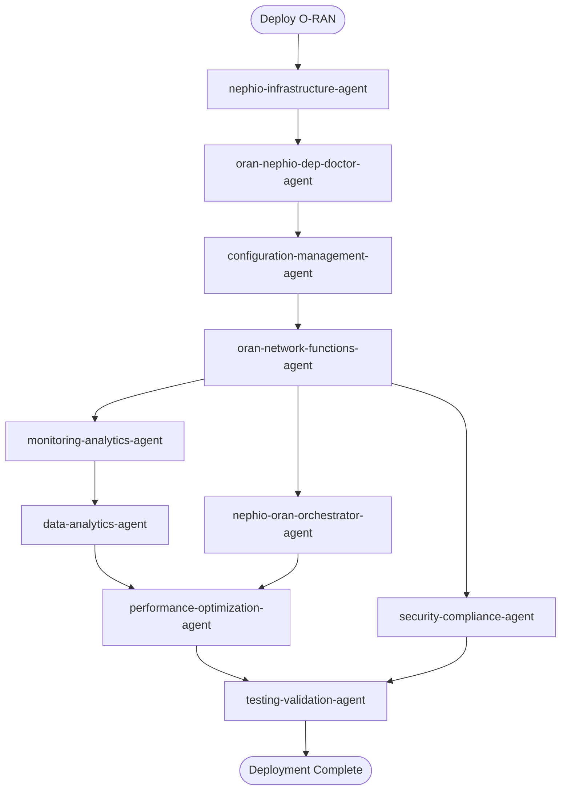

# Nephio-O-RAN Claude Code Agents

**Production-ready** specialized AI subagents for Nephio and O-RAN telecommunications automation. Properly configured for Claude Code's subagent system with correct tool assignments and YAML frontmatter format.

[](https://opensource.org/licenses/Apache-2.0)
[](https://docs.anthropic.com/en/docs/claude-code/sub-agents)
[](https://thc1006.github.io/nephio-oran-claude-agents/)
[]()
[]()
[]()
[]()
[]()

## 📚 Documentation Website

**Visit our comprehensive documentation**: [https://thc1006.github.io/nephio-oran-claude-agents/](https://thc1006.github.io/nephio-oran-claude-agents/)

The documentation website includes:
- 📖 Detailed agent documentation
- 🎯 Interactive compatibility matrices
- 🌐 Multi-language support (English & Traditional Chinese)
- 🔍 Full-text search
- 🌙 Dark/Light theme

### Running Documentation Locally

```bash
# Navigate to website directory
cd website

# Install dependencies
npm install

# Start development server
npm start
# Website available at http://localhost:3000/nephio-oran-claude-agents/

# Build for production
npm run build
```

## 🌐 GitHub Pages Deployment

The documentation website is automatically deployed to GitHub Pages from the main branch. The site is built using Docusaurus and hosted at:

**Live Site**: [https://thc1006.github.io/nephio-oran-claude-agents/](https://thc1006.github.io/nephio-oran-claude-agents/)

### Building and Deploying Locally

```bash
# Build the documentation website
cd website
npm install
npm run build

# The built site will be in website/dist/
# Copy to root for GitHub Pages deployment
cp -r website/dist/* ../
```

### Important Notes:
- The `.nojekyll` file in the root disables Jekyll processing (we use Docusaurus instead)
- The site is served from the root directory of the main branch
- Automatic deployment occurs on push to main via GitHub Actions

## 🚀 Quick Start (2 minutes)

```bash
# 1. Clone the repository
git clone https://github.com/thc1006/nephio-oran-claude-agents.git
cd nephio-oran-claude-agents

# 2. Install agents globally (recommended)
mkdir -p ~/.claude/agents
cp agents/*.md ~/.claude/agents/

# 3. Verify installation
claude code
# Type: /agents
# You should see all 10 agents listed

# 4. Start using agents
claude code "Deploy O-Cloud infrastructure with Nephio"
```

## ⚠️ Important Prerequisites

- **Claude Code v1.0.60+** required for subagent support
- Agents use Claude Code's built-in tools only (Read, Write, Bash, Search, Git)
- No external tool dependencies needed

## 🎯 Version Compatibility

All agents enforce consistent versioning:
- **O-RAN SC**: L Release (released 2025-06-30)
- **Nephio**: R5 (v5.x)
- **Go**: 1.24.6
- **kpt**: v1.0.0-beta.55
- **Kubernetes**: Latest three minor releases policy

## 📦 What You Get

**10 Production-Ready Subagents** with proper YAML frontmatter and Claude Code tool configuration:

### 🏗️ Infrastructure & Configuration

| Agent | Purpose | Model |
|-------|---------|-------|
| **[nephio-infrastructure-agent](agents/nephio-infrastructure-agent.md)** | Deploy and manage Nephio infrastructure with ArgoCD GitOps | haiku |
| **[configuration-management-agent](agents/configuration-management-agent.md)** | YANG models, Kpt packages, Helm charts, ArgoCD ApplicationSets | haiku |
| **[oran-nephio-dep-doctor-agent](agents/oran-nephio-dep-doctor-agent.md)** | Diagnose and fix dependency issues in deployments | haiku |

### 🎮 Orchestration & Operations

| Agent | Purpose | Model |
|-------|---------|-------|
| **[nephio-oran-orchestrator-agent](agents/nephio-oran-orchestrator-agent.md)** | End-to-end O-RAN deployment on Nephio infrastructure | opus |
| **[oran-network-functions-agent](agents/oran-network-functions-agent.md)** | Deploy RAN network functions (CU/DU/RU) with vendor abstraction | haiku |
| **[performance-optimization-agent](agents/performance-optimization-agent.md)** | Optimize RAN performance with AI/ML integration | haiku |

### 📊 Monitoring & Analytics

| Agent | Purpose | Model |
|-------|---------|-------|
| **[monitoring-analytics-agent](agents/monitoring-analytics-agent.md)** | Real-time monitoring with Prometheus, Grafana, and SMO integration | haiku |
| **[data-analytics-agent](agents/data-analytics-agent.md)** | Advanced analytics with Jupyter Notebooks and TensorFlow | haiku |

### 🔒 Security & Compliance

| Agent | Purpose | Model |
|-------|---------|-------|
| **[security-compliance-agent](agents/security-compliance-agent.md)** | Kubernetes security and O-RAN compliance validation | haiku |
| **[testing-validation-agent](agents/testing-validation-agent.md)** | Comprehensive testing with ONAP OTIC framework | haiku |

## 🤝 Agent Workflow DAG

The agents follow a directed acyclic graph (DAG) workflow that prevents circular dependencies:



## 🏃 Usage Examples

### Basic O-RAN Deployment
```bash
claude code "Deploy a complete O-RAN infrastructure with Nephio R5"
```

### Network Function Deployment
```bash
claude code "Deploy Nokia CU/DU on the existing Nephio cluster"
```

### Performance Optimization
```bash
claude code "Optimize RAN performance for edge deployment"
```

### Security Audit
```bash
claude code "Run security compliance check for O-RAN deployment"
```

## 🔧 Advanced Features

- **Vendor Abstraction**: Support for Nokia, Ericsson, Samsung, ZTE
- **GitOps Automation**: ArgoCD ApplicationSets for declarative deployments
- **AI/ML Integration**: Kubeflow pipelines for RAN optimization
- **Multi-Cloud**: AWS, Azure, GCP, and on-premise support
- **FIPS 140-3**: Security compliance capability (requires validated builds)

## 📁 Repository Structure

```
nephio-oran-claude-agents/
├── agents/                 # Agent markdown files with YAML frontmatter
├── website/               # Documentation website (Docusaurus v3)
│   ├── docs/             # Documentation content
│   ├── src/              # React components
│   └── package.json      # Website dependencies
├── .github/workflows/     # CI/CD pipelines
├── tests/                # Agent tests and validation
├── tools/                # Helper scripts
└── README.md            # This file
```

## 🤝 Contributing

We welcome contributions! Please see our [Contributing Guide](CONTRIBUTING.md) for details.

### Development Setup

```bash
# Clone repository
git clone https://github.com/thc1006/nephio-oran-claude-agents.git
cd nephio-oran-claude-agents

# Run tests
./tools/test_dag_cycles.sh

# Validate agents
./tools/validate_agents.sh

# Run documentation website
cd website && npm start
```

## 📊 Testing

The repository includes comprehensive testing:
- DAG cycle detection
- Agent dependency validation
- Version consistency checks
- YAML frontmatter validation

Run all tests:
```bash
./tools/run_all_tests.sh
```

## 📄 License

Apache License 2.0 - See [LICENSE](LICENSE) file for details.

## 🙏 Acknowledgments

- **Nephio Project** - Cloud-native automation platform
- **O-RAN Alliance** - Open RAN specifications
- **Claude by Anthropic** - AI assistant platform
- **Community Contributors** - Thank you for your support!

## 📮 Support

- **Documentation**: [https://thc1006.github.io/nephio-oran-claude-agents/](https://thc1006.github.io/nephio-oran-claude-agents/)
- **Issues**: [GitHub Issues](https://github.com/thc1006/nephio-oran-claude-agents/issues)
- **Discussions**: [GitHub Discussions](https://github.com/thc1006/nephio-oran-claude-agents/discussions)

---

**Note**: This project enforces strict version normalization:
- O-RAN L (released 2025-06-30)
- Nephio R5 (v5.x)
- Go 1.24.6
- kpt v1.0.0-beta.55
- Kubernetes (latest three minor releases)

All agents and documentation maintain these version standards automatically.