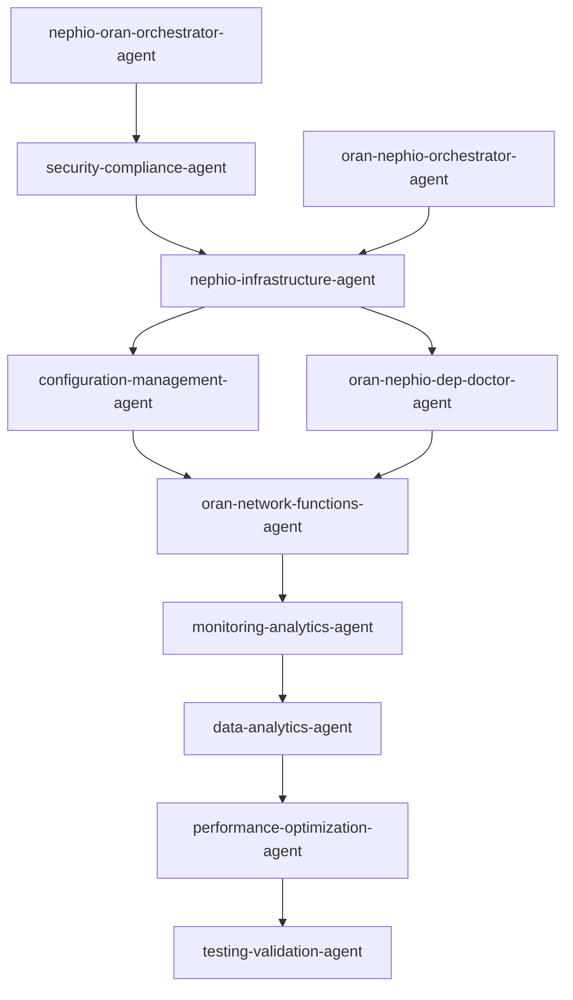

# Agent Collaboration Matrix

## Overview

This document defines the collaboration protocol between agents, forming a Directed Acyclic Graph (DAG) for workflow orchestration.

## Agent Collaboration Flow



## Agent Roles

### Source Agents (Entry Points)
1. **nephio-infrastructure-agent** - Primary entry point for infrastructure provisioning
2. **nephio-oran-orchestrator-agent** - Orchestration entry point
3. **oran-nephio-orchestrator-agent** - Alternative orchestration entry

### Sink Agents (Terminal Points)
1. **testing-validation-agent** - Primary terminal point for validation
2. **monitoring-analytics-agent** - Can be terminal for monitoring-only workflows

### Intermediate Agents
- **configuration-management-agent** - Configuration and GitOps
- **oran-network-functions-agent** - Network function deployment
- **security-compliance-agent** - Security validation
- **oran-nephio-dep-doctor-agent** - Dependency resolution
- **data-analytics-agent** - Data processing
- **performance-optimization-agent** - Performance tuning

## Standard Workflow Patterns

### Pattern 1: Full Deployment Pipeline
```
nephio-infrastructure-agent 
  → configuration-management-agent 
  → oran-network-functions-agent 
  → monitoring-analytics-agent 
  → data-analytics-agent 
  → performance-optimization-agent 
  → testing-validation-agent
```

### Pattern 2: Security-First Deployment
```
nephio-oran-orchestrator-agent 
  → security-compliance-agent 
  → nephio-infrastructure-agent 
  → [Pattern 1]
```

### Pattern 3: Dependency Resolution Flow
```
nephio-infrastructure-agent 
  → oran-nephio-dep-doctor-agent 
  → oran-network-functions-agent 
  → [continue Pattern 1]
```

## Collaboration Rules

1. **No Cycles**: The graph must remain acyclic
2. **Single Responsibility**: Each agent has a specific role
3. **Clear Handoffs**: Use `handoff_to` and `accepts_from` metadata
4. **Error Propagation**: Failed agents should report back to orchestrator
5. **Validation Terminal**: All paths should eventually reach testing-validation-agent

## Agent Metadata Format

Each agent should include the following in their markdown frontmatter:

```yaml
---
name: agent-name
accepts_from: 
  - source-agent-1
  - source-agent-2
handoff_to: target-agent
collaboration_role: source|intermediate|sink
---
```

## Validation

Run the DAG checker to validate the collaboration graph:

```bash
go run tools/dagcheck/main.go --dir agents
```

This will:
- Verify no cycles exist
- Check all edges are valid
- Confirm expected source/sink agents
- Generate visualization

## CI/CD Integration

The DAG validation runs automatically in CI:
- On every PR to validate changes
- Generates `dag_report.md` with results
- Creates visualization PNG if Graphviz available
- Fails build on invalid DAG structure