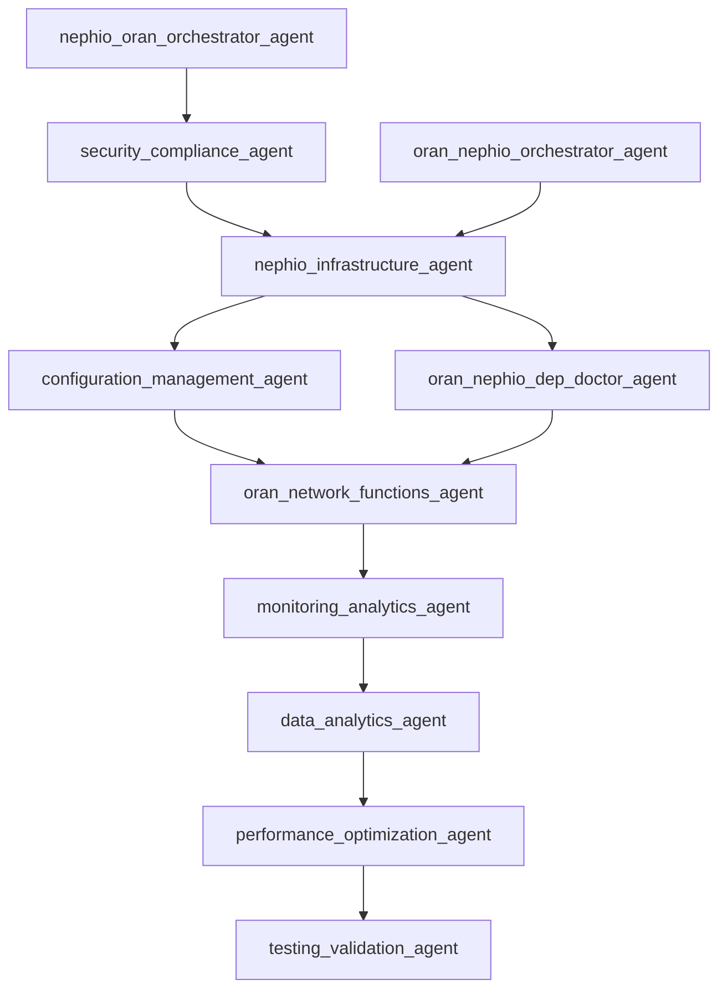

# Agent Collaboration DAG Report

Generated: 2025-01-19 15:30:00

## Validation Status

✅ **PASSED**: The agent collaboration graph is a valid DAG

## Statistics

- Total Agents: 11
- Source Agents: 3
- Sink Agents: 1
- Total Edges: 10
- Cycles Detected: 0
- Broken Edges: 0

## Source Agents (Entry Points)

- **nephio-infrastructure-agent** ✅ (Expected)
- **nephio-oran-orchestrator-agent**
- **oran-nephio-orchestrator-agent**

## Sink Agents (Terminal Points)

- **testing-validation-agent** ✅ (Expected)

## Adjacency List



## Agent Details

### configuration-management-agent

- **File**: `agents/configuration-management-agent.md`
- **Accepts From**: nephio-infrastructure-agent
- **Hands Off To**: oran-network-functions-agent

### data-analytics-agent

- **File**: `agents/data-analytics-agent.md`
- **Accepts From**: monitoring-analytics-agent
- **Hands Off To**: performance-optimization-agent

### monitoring-analytics-agent

- **File**: `agents/monitoring-analytics-agent.md`
- **Accepts From**: oran-network-functions-agent
- **Hands Off To**: data-analytics-agent

### nephio-infrastructure-agent

- **File**: `agents/nephio-infrastructure-agent.md`
- **Accepts From**: security-compliance-agent, oran-nephio-orchestrator-agent
- **Hands Off To**: oran-nephio-dep-doctor-agent, configuration-management-agent

### nephio-oran-orchestrator-agent

- **File**: `agents/nephio-oran-orchestrator-agent.md`
- **Accepts From**: *None*
- **Hands Off To**: security-compliance-agent

### oran-nephio-dep-doctor-agent

- **File**: `agents/oran-nephio-dep-doctor-agent.md`
- **Accepts From**: nephio-infrastructure-agent
- **Hands Off To**: oran-network-functions-agent

### oran-nephio-orchestrator-agent

- **File**: `agents/oran-nephio-orchestrator-agent.md`
- **Accepts From**: *None*
- **Hands Off To**: nephio-infrastructure-agent

### oran-network-functions-agent

- **File**: `agents/oran-network-functions-agent.md`
- **Accepts From**: configuration-management-agent, oran-nephio-dep-doctor-agent
- **Hands Off To**: monitoring-analytics-agent

### performance-optimization-agent

- **File**: `agents/performance-optimization-agent.md`
- **Accepts From**: data-analytics-agent
- **Hands Off To**: testing-validation-agent

### security-compliance-agent

- **File**: `agents/security-compliance-agent.md`
- **Accepts From**: nephio-oran-orchestrator-agent
- **Hands Off To**: nephio-infrastructure-agent

### testing-validation-agent

- **File**: `agents/testing-validation-agent.md`
- **Accepts From**: performance-optimization-agent
- **Hands Off To**: *None*

## Visualization


## Workflow Patterns

### Primary Deployment Flow
```
nephio-infrastructure-agent 
  → configuration-management-agent 
  → oran-network-functions-agent 
  → monitoring-analytics-agent 
  → data-analytics-agent 
  → performance-optimization-agent 
  → testing-validation-agent
```

### Security-First Flow
```
nephio-oran-orchestrator-agent 
  → security-compliance-agent 
  → nephio-infrastructure-agent 
  → [Primary Flow]
```

### Dependency Resolution Flow
```
nephio-infrastructure-agent 
  → oran-nephio-dep-doctor-agent 
  → oran-network-functions-agent 
  → [Continue Primary Flow]
```

## Validation Results

✅ No cycles detected in the collaboration graph
✅ All agent references are valid
✅ Expected source agent (nephio-infrastructure-agent) confirmed
✅ Expected sink agent (testing-validation-agent) confirmed
✅ Graph forms a proper DAG structure

---

*Generated by tools/dagcheck/main.go*