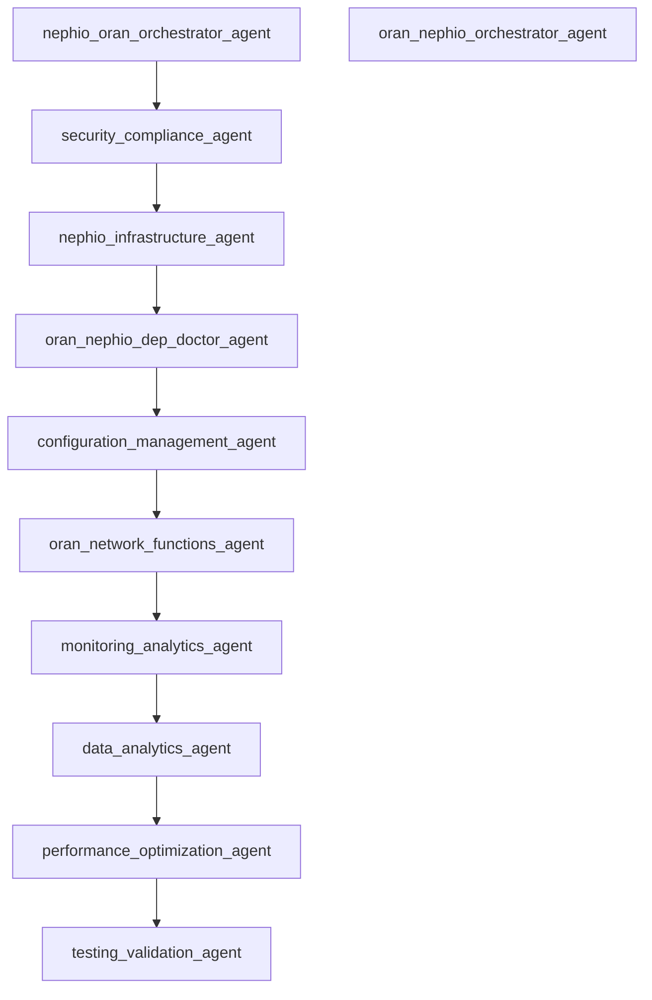

# Agent Collaboration DAG Report

Generated: 2025-08-20 00:01:17

## Validation Status

✅ **PASSED**: The agent collaboration graph is a valid DAG

## Statistics

- Total Agents: 11
- Source Agents: 2
- Sink Agents: 2
- Total Edges: 9
- Cycles Detected: 0
- Broken Edges: 0

## ⚠️ Warnings

- Expected source agent 'nephio-infrastructure-agent' is not a source (has incoming edges)

## Source Agents (Entry Points)

- **nephio-oran-orchestrator-agent**
- **oran-nephio-orchestrator-agent**

## Sink Agents (Terminal Points)

- **oran-nephio-orchestrator-agent**
- **testing-validation-agent** ✅ (Expected)

## Adjacency List

## Agent Details

### configuration-management-agent

- **File**: `..\..\agents\configuration-management-agent.md`
- **Accepts From**: *None*
- **Hands Off To**: oran-network-functions-agent

### data-analytics-agent

- **File**: `..\..\agents\data-analytics-agent.md`
- **Accepts From**: *None*
- **Hands Off To**: performance-optimization-agent

### monitoring-analytics-agent

- **File**: `..\..\agents\monitoring-analytics-agent.md`
- **Accepts From**: *None*
- **Hands Off To**: data-analytics-agent

### nephio-infrastructure-agent

- **File**: `..\..\agents\nephio-infrastructure-agent.md`
- **Accepts From**: *None*
- **Hands Off To**: oran-nephio-dep-doctor-agent

### nephio-oran-orchestrator-agent

- **File**: `..\..\agents\nephio-oran-orchestrator-agent.md`
- **Accepts From**: *None*
- **Hands Off To**: security-compliance-agent

### oran-nephio-dep-doctor-agent

- **File**: `..\..\agents\oran-nephio-dep-doctor-agent.md`
- **Accepts From**: *None*
- **Hands Off To**: configuration-management-agent

### oran-nephio-orchestrator-agent

- **File**: `..\..\agents\oran-nephio-orchestrator-agent.md`
- **Accepts From**: *None*
- **Hands Off To**: *None*

### oran-network-functions-agent

- **File**: `..\..\agents\oran-network-functions-agent.md`
- **Accepts From**: *None*
- **Hands Off To**: monitoring-analytics-agent

### performance-optimization-agent

- **File**: `..\..\agents\performance-optimization-agent.md`
- **Accepts From**: *None*
- **Hands Off To**: testing-validation-agent

### security-compliance-agent

- **File**: `..\..\agents\security-compliance-agent.md`
- **Accepts From**: *None*
- **Hands Off To**: nephio-infrastructure-agent

### testing-validation-agent

- **File**: `..\..\agents\testing-validation-agent.md`
- **Accepts From**: *None*
- **Hands Off To**: *None*

## Visualization

*Visualization not available. Install Graphviz and run with --png flag*

