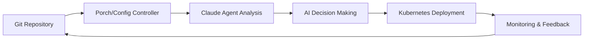

# Core Concepts and Architecture

Welcome to the core concepts section! This comprehensive guide will help you understand the fundamental principles, architecture, and design decisions behind Nephio O-RAN Claude Agents.

## Overview

Nephio O-RAN Claude Agents represent a revolutionary approach to network function orchestration, combining the power of Claude AI with the flexibility of Nephio's Kubernetes-native platform. This section explores the key concepts that make this integration possible.

## Fundamental Concepts

### Intelligent Agent Architecture

Our agents are built on several core principles:

- **AI-Driven Decision Making**: Each agent leverages Claude AI to make intelligent decisions about network function deployment and management
- **Kubernetes-Native**: Full integration with Kubernetes and Nephio's GitOps workflow
- **Event-Driven Architecture**: Reactive system that responds to cluster events and changes
- **Declarative Configuration**: Infrastructure and network functions defined as code

### Agent Types and Roles

#### 🎼 Orchestration Agents

- **Primary Role**: High-level workflow coordination
- **Key Functions**: Deployment planning, resource allocation, dependency management
- **Example**: [Nephio O-RAN Orchestrator Agent](../orchestration/nephio-oran-orchestrator-agent.md)

#### 🏗️ Infrastructure Agents  

- **Primary Role**: Cluster and infrastructure management
- **Key Functions**: Node provisioning, network configuration, resource monitoring
- **Examples**: [Infrastructure Agent](../infrastructure/nephio-infrastructure-agent.md), [Deployment Doctor](../infrastructure/oran-nephio-dep-doctor-agent.md)

#### 📊 Analytics and Monitoring Agents

- **Primary Role**: Data collection, analysis, and observability
- **Key Functions**: Performance monitoring, anomaly detection, capacity planning
- **Examples**: [Data Analytics Agent](../analytics/data-analytics-agent.md), [Monitoring Agent](../monitoring/monitoring-analytics-agent.md)

#### ⚙️ Configuration Management Agents

- **Primary Role**: Configuration lifecycle management
- **Key Functions**: Config validation, drift detection, compliance checking
- **Example**: [Configuration Management Agent](../config-management/configuration-management-agent.md)

#### 🛡️ Security and Compliance Agents

- **Primary Role**: Security posture management
- **Key Functions**: Policy enforcement, vulnerability scanning, compliance reporting
- **Example**: [Security Compliance Agent](../security/security-compliance-agent.md)

## Architectural Principles

### Cloud-Native Design

Our architecture follows cloud-native principles:

```yaml
apiVersion: v1
kind: ConfigMap
metadata:
  name: agent-principles
data:
  scalability: "Horizontal scaling with Kubernetes"
  resilience: "Self-healing and fault-tolerant"
  observability: "Comprehensive metrics and logging"
  security: "Zero-trust security model"
```

### AI Integration Patterns

#### Prompt Engineering

- **Structured Prompts**: Consistent input formats for reliable AI responses
- **Context Awareness**: Agents understand current cluster state and history
- **Decision Transparency**: AI reasoning is logged and auditable

#### Feedback Loops

- **Learning from Outcomes**: Agents improve decisions based on deployment results
- **Continuous Optimization**: Performance metrics guide future AI recommendations
- **Human-in-the-Loop**: Critical decisions can require human approval

## O-RAN Integration

### O-RAN Architecture Alignment

Our agents are designed to work seamlessly with O-RAN architecture:

#### Near Real-Time RIC (nRT-RIC)

- **xApp Management**: Intelligent deployment and lifecycle management of xApps
- **Policy Coordination**: Seamless integration with RAN Intelligent Controller
- **Performance Optimization**: AI-driven resource allocation for optimal performance

#### Non-Real-Time RIC (Non-RT RIC)

- **rApp Orchestration**: Coordinated deployment of RAN applications
- **Service Management**: End-to-end service lifecycle management
- **Data Analytics**: Integration with SMO data lake and analytics platforms

#### O-Cloud Infrastructure

- **Resource Management**: Intelligent allocation of compute, storage, and network resources
- **Multi-tenancy**: Support for multiple O-RAN deployments on shared infrastructure
- **Edge Computing**: Optimization for distributed edge deployment scenarios

### Interface Standards

Our agents support key O-RAN interfaces:

- **A1 Interface**: Policy and enrichment information exchange
- **E2 Interface**: Near real-time control and monitoring
- **O1 Interface**: Operations, Administration, and Maintenance (OAM)
- **O2 Interface**: O-Cloud infrastructure management

## Nephio Integration

### GitOps Workflow



### Package-Based Management

- **KPT Packages**: Configuration distributed as versioned packages
- **Package Variants**: Environment-specific customizations
- **Dependency Management**: Automated handling of package dependencies

### Resource Orchestration

- **Custom Resources**: Nephio-specific CRDs for O-RAN components
- **Controllers**: Kubernetes controllers extended with AI capabilities
- **Operators**: Specialized operators for complex network functions

## Data Flow and State Management

### State Synchronization

```yaml
# Example: Agent state coordination
apiVersion: agents.nephio.org/v1
kind: AgentCoordination
metadata:
  name: oran-deployment-coordination
spec:
  agents:
    - name: orchestrator-agent
      role: primary
      responsibilities: ["planning", "coordination"]
    - name: infrastructure-agent
      role: secondary
      responsibilities: ["resource-validation", "capacity-check"]
    - name: monitoring-agent
      role: observer
      responsibilities: ["metrics-collection", "alerting"]
```

### Event-Driven Communication

- **Kubernetes Events**: Native event system for agent communication
- **Custom Events**: Domain-specific events for O-RAN operations
- **Event Correlation**: AI-powered event analysis and correlation

## Security Model

### Zero-Trust Architecture

- **Identity Verification**: Every agent request is authenticated and authorized
- **Network Segmentation**: Agents operate in isolated network segments
- **Least Privilege**: Minimal required permissions for each agent

### AI Security Considerations

- **Prompt Injection Protection**: Safeguards against malicious prompt manipulation
- **Decision Auditability**: All AI decisions are logged and auditable
- **Bias Detection**: Monitoring for AI bias in decision-making processes

## Performance and Scalability

### Horizontal Scaling

```yaml
apiVersion: apps/v1
kind: Deployment
metadata:
  name: claude-agent
spec:
  replicas: 3  # Scale based on workload
  template:
    spec:
      containers:
      - name: agent
        resources:
          requests:
            memory: "256Mi"
            cpu: "250m"
          limits:
            memory: "512Mi"
            cpu: "500m"
```

### Resource Optimization

- **Intelligent Batching**: Group similar operations for efficiency
- **Caching Strategies**: Cache frequently accessed data and AI responses
- **Resource Pooling**: Shared resources across agent instances

## Deployment Patterns

### Multi-Environment Support

- **Development**: Lightweight agents for testing and development
- **Staging**: Full-featured agents for pre-production validation
- **Production**: Highly available, secure agents for live deployments

### High Availability

- **Agent Redundancy**: Multiple agent instances for fault tolerance
- **State Replication**: Shared state across agent instances
- **Graceful Degradation**: Fallback modes when AI services are unavailable

## Monitoring and Observability

### Comprehensive Metrics

```yaml
# Agent metrics exposed via Prometheus
- agent_decisions_total{agent="orchestrator", outcome="success"}
- agent_response_time_seconds{agent="monitoring", operation="health_check"}
- agent_ai_tokens_used{agent="infrastructure", model="claude"}
```

### Distributed Tracing

- **End-to-End Tracing**: Track requests across all agent interactions
- **Performance Analysis**: Identify bottlenecks in agent workflows  
- **Error Correlation**: Link errors to specific agent decisions

## Next Steps

Now that you understand the core concepts, explore these areas:

### Deep Dive Topics

1. **[Agent Architecture](../architecture/index.md)** - Detailed technical architecture
2. **[Integration Patterns](../integration/index.md)** - How agents integrate with existing systems
3. **[API Reference](../04-api-reference/index.md)** - Complete API documentation

### Practical Applications

1. **[Examples](/docs/examples/)** - Real-world deployment scenarios
2. **[Troubleshooting](/docs/07-troubleshooting/)** - Common issues and solutions
3. **[Agent Guides](/docs/agents/)** - Individual agent documentation

## Community and Contribution

### Contributing to Core Concepts

- **Documentation**: Help improve concept explanations
- **Examples**: Contribute real-world use cases
- **Feedback**: Share your experiences and suggestions

### Research and Development

- **AI Enhancement**: Contribute to agent intelligence improvements
- **Performance Optimization**: Help optimize agent performance
- **New Patterns**: Develop new integration patterns

---

*These concepts form the foundation of Nephio O-RAN Claude Agents. Understanding them will help you effectively deploy and manage intelligent network functions.*

*Last updated: August 2025*
