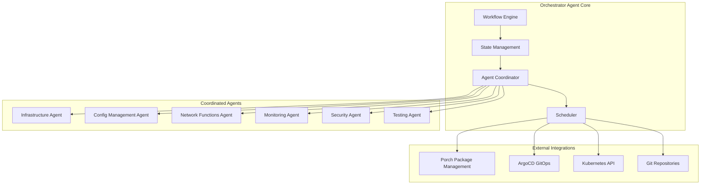

# Nephio O-RAN Orchestrator Agent

The **Nephio O-RAN Orchestrator Agent** serves as the master coordinator for complex Nephio R5 and
O-RAN L Release deployments. This agent orchestrates multi-agent workflows, manages package variants
across clusters, and ensures end-to-end deployment consistency.

## 🎯 Agent Overview

| Property         | Value                                       |
| ---------------- | ------------------------------------------- |
| **Name**         | orchestrator-agent                          |
| **Model**        | Claude Opus                                 |
| **Version**      | 3.0.0                                       |
| **Tools**        | Read, Write, Bash, Search, Git              |
| **Primary Role** | Master coordination and workflow management |

## 🏗️ Architecture



## ⚡ Core Capabilities

### 1. Multi-Cluster Orchestration

- **Cluster Registration**: Automatically register and manage multiple Kubernetes clusters
- **Cross-Cluster Networking**: Configure cluster-to-cluster communication
- **Load Balancing**: Distribute workloads across clusters based on capacity and location
- **Failover Management**: Handle cluster failures with automatic workload migration

### 2. Package Variant Management

- **PackageVariantSet Creation**: Generate site-specific configurations from blueprints
- **Template Customization**: Apply environment-specific parameters
- **Version Control**: Manage package versions across deployment lifecycles
- **Rollback Capabilities**: Safe rollback to previous package versions

### 3. Workflow Coordination

- **Agent Orchestration**: Coordinate execution across specialized agents
- **Dependency Management**: Ensure proper order of operations
- **State Tracking**: Maintain deployment state across complex workflows
- **Error Recovery**: Handle failures with intelligent retry and recovery strategies

### 4. Network Slice Management

- **Slice Intent Processing**: Deploy network slices based on high-level requirements
- **Resource Allocation**: Automatically allocate compute, network, and storage resources
- **SLA Monitoring**: Ensure network slice performance meets requirements
- **Dynamic Scaling**: Scale slice resources based on demand

## 🔧 API Reference

### Core Commands

#### `deploy everything`

Initiates a complete O-RAN stack deployment including infrastructure, configuration, and network
functions.

**Workflow:**

1. Create workflow state directory
2. Validate environment prerequisites
3. Coordinate with infrastructure agent for cluster setup
4. Hand off to configuration management for baseline configs
5. Deploy network functions via network functions agent
6. Set up monitoring and analytics
7. Run validation tests

**Example:**

```bash
claude-agent orchestrator-agent "deploy everything"
```

#### `setup multi-cluster`

Configures multi-cluster deployment with ArgoCD ApplicationSets and cross-cluster networking.

**Parameters:**

- `clusters`: List of cluster names to register
- `network-policy`: Cross-cluster networking configuration
- `load-balancing`: Traffic distribution strategy

**Example:**

```bash
claude-agent orchestrator-agent "setup multi-cluster with edge-01,edge-02,core-01"
```

#### `create package variants`

Generates PackageVariantSet resources for site-specific deployments.

**Parameters:**

- `upstream-package`: Source package from catalog
- `target-sites`: List of deployment sites
- `customizations`: Site-specific parameter overrides

**Example:**

```bash
claude-agent orchestrator-agent "create package variants for oran-du targeting edge-sites"
```

#### `deploy network slice`

Creates and deploys network slices based on intent specifications.

**Parameters:**

- `slice-type`: eMBB, mIoT, URLLC
- `requirements`: Bandwidth, latency, reliability targets
- `sites`: Deployment locations

**Example:**

```bash
claude-agent orchestrator-agent "deploy network slice embb with 1Gbps bandwidth 10ms latency"
```

#### `validate deployment`

Runs comprehensive end-to-end validation of the entire deployment.

**Checks:**

- Infrastructure health
- Network function status
- Configuration consistency
- Performance metrics
- Security compliance

**Example:**

```bash
claude-agent orchestrator-agent "validate deployment"
```

#### `rollback`

Safely rolls back deployments to previous known-good state.

**Features:**

- Automatic backup creation
- ArgoCD application rollback
- PackageVariant cleanup
- Configuration restoration

**Example:**

```bash
claude-agent orchestrator-agent "rollback to previous version"
```

### Workflow Management API

#### State Management

The orchestrator maintains workflow state in `~/.claude-workflows/state.json`:

```json
{
  "stage": "infrastructure|configuration|deployment|validation|complete",
  "timestamp": "2025-08-22T10:30:00Z",
  "completed": ["orchestrator", "infrastructure-agent"],
  "next": "configuration-management-agent",
  "context": {
    "deployment_type": "multi-cluster|single-cluster",
    "sites": ["edge-01", "edge-02"],
    "slice": "embb|urllc|miot",
    "parameters": {...}
  }
}
```

#### Agent Coordination

Workflow stages and responsible agents:

| Stage             | Agent                          | Description                |
| ----------------- | ------------------------------ | -------------------------- |
| infrastructure    | infrastructure-agent           | Kubernetes cluster setup   |
| dependencies      | dependency-doctor-agent        | Dependency validation      |
| configuration     | configuration-management-agent | Base configuration         |
| network-functions | network-functions-agent        | O-RAN component deployment |
| monitoring        | monitoring-agent               | Observability setup        |
| analytics         | data-analytics-agent           | Data pipeline setup        |
| security          | security-compliance-agent      | Security hardening         |
| testing           | testing-validation-agent       | End-to-end validation      |

## 📊 Configuration Examples

### Multi-Cluster ApplicationSet

```yaml
apiVersion: argoproj.io/v1alpha1
kind: ApplicationSet
metadata:
  name: multi-cluster-oran
  namespace: argocd
spec:
  generators:
    - clusters:
        selector:
          matchLabels:
            oran-enabled: 'true'
  template:
    metadata:
      name: '{{name}}-oran'
    spec:
      project: default
      source:
        repoURL: https://github.com/nephio-project/catalog
        targetRevision: main
        path: workloads/oran
      destination:
        server: '{{server}}'
        namespace: oran
      syncPolicy:
        automated:
          prune: true
          selfHeal: true
        syncOptions:
          - CreateNamespace=true
```

### PackageVariantSet Configuration

```yaml
apiVersion: config.porch.kpt.dev/v1alpha2
kind: PackageVariantSet
metadata:
  name: oran-deployment-set
  namespace: nephio-system
spec:
  upstream:
    package: oran-complete
    repo: catalog
    revision: v2.0.0
  targets:
    - objectSelector:
        apiVersion: infra.nephio.org/v1alpha1
        kind: WorkloadCluster
        matchLabels:
          nephio.org/region: us-east
  template:
    downstream:
      packageExpr: 'oran-{{cluster.name}}'
      repoExpr: 'deployments'
    packageContext:
      data:
        - key: site-id
          valueExpr: '{{cluster.metadata.labels.site-id}}'
        - key: region
          valueExpr: '{{cluster.metadata.labels.region}}'
```

### Network Slice Intent

```yaml
apiVersion: nephio.org/v1alpha1
kind: NetworkSlice
metadata:
  name: enterprise-embb-slice
  namespace: default
spec:
  sliceType: enhanced-mobile-broadband
  sliceId: '100001'
  sites:
    - name: edge-manufacturing
      cu: 2
      du: 4
      ru: 8
    - name: edge-logistics
      cu: 1
      du: 2
      ru: 4
  requirements:
    bandwidth: 5Gbps
    latency: 5ms
    reliability: 99.999
    availability: 99.99
  qosPolicy:
    priorityLevel: 1
    trafficClass: 'conversational'
    allocationRetentionPriority: 1
```

## 🔍 Monitoring and Observability

### Key Metrics

The orchestrator exposes the following metrics:

```prometheus
# Workflow execution time
oran_orchestrator_workflow_duration_seconds{stage="infrastructure|configuration|..."}

# Agent coordination success rate
oran_orchestrator_agent_coordination_success_rate{agent="infrastructure-agent|..."}

# Package variant generation rate
oran_orchestrator_package_variants_generated_total{upstream_package="oran-du|..."}

# Network slice deployment success rate
oran_orchestrator_network_slice_success_rate{slice_type="embb|urllc|miot"}

# Multi-cluster sync status
oran_orchestrator_cluster_sync_status{cluster="edge-01|..."}
```

### Health Checks

Regular health checks monitor:

- Workflow engine status
- Agent connectivity
- Porch API availability
- ArgoCD synchronization status
- Kubernetes API responsiveness

### Logging

Structured logs include:

```json
{
  "timestamp": "2025-08-22T10:30:00Z",
  "level": "INFO",
  "component": "orchestrator-agent",
  "workflow_id": "wf-12345",
  "stage": "infrastructure",
  "agent": "infrastructure-agent",
  "message": "Initiating cluster provisioning",
  "context": {
    "sites": ["edge-01", "edge-02"],
    "deployment_type": "multi-cluster"
  }
}
```

## ⚙️ Configuration

### Environment Variables

```bash
# Workflow configuration
ORCHESTRATOR_WORKFLOW_TIMEOUT=3600          # Workflow timeout in seconds
ORCHESTRATOR_MAX_RETRIES=3                  # Max retry attempts per operation
ORCHESTRATOR_STATE_DIR="~/.claude-workflows" # Workflow state directory

# Integration endpoints
PORCH_API_ENDPOINT="http://porch-server.porch-system:8080"
ARGOCD_API_ENDPOINT="https://argocd-server.argocd:443"
KUBERNETES_CONFIG_PATH="~/.kube/config"

# Package management
DEFAULT_CATALOG_REPO="https://github.com/nephio-project/catalog"
DEFAULT_DEPLOYMENT_REPO="https://github.com/your-org/deployments"
PACKAGE_APPROVAL_REQUIRED=true

# Network slicing
NETWORK_SLICE_CONTROLLER="nephio.org/network-slice-controller"
DEFAULT_SLICE_TEMPLATE="standard-embb"
```

### Configuration File (`orchestrator-config.yaml`)

```yaml
orchestrator:
  workflow:
    timeout: 3600
    maxRetries: 3
    stateDirectory: '~/.claude-workflows'

  agents:
    infrastructure:
      name: 'infrastructure-agent'
      timeout: 1800
      required: true
    configuration:
      name: 'configuration-management-agent'
      timeout: 900
      required: true
    networkFunctions:
      name: 'network-functions-agent'
      timeout: 1200
      required: true
    monitoring:
      name: 'monitoring-agent'
      timeout: 600
      required: false

  integrations:
    porch:
      endpoint: 'http://porch-server.porch-system:8080'
      timeout: 30
    argocd:
      endpoint: 'https://argocd-server.argocd:443'
      timeout: 60

  packageManagement:
    catalogRepo: 'https://github.com/nephio-project/catalog'
    deploymentRepo: 'https://github.com/your-org/deployments'
    approvalRequired: true

  networkSlicing:
    controller: 'nephio.org/network-slice-controller'
    defaultTemplate: 'standard-embb'
```

## 🛠️ Troubleshooting

### Common Issues

#### Workflow Stuck in Progress

**Symptoms:** Workflow state shows ongoing execution but no progress **Diagnosis:**

```bash
# Check workflow state
cat ~/.claude-workflows/state.json

# Check current agent status
kubectl get pods -n claude-agents

# Check agent logs
kubectl logs -n claude-agents -l app=infrastructure-agent --tail=50
```

**Resolution:**

- Restart stuck agent
- Clear workflow state and retry
- Check network connectivity between components

#### Package Variant Generation Failures

**Symptoms:** PackageVariantSet exists but no PackageRevisions created **Diagnosis:**

```bash
# Check Porch server status
kubectl get pods -n porch-system

# Check PackageVariantSet status
kubectl describe packagevariantset edge-deployment-set -n nephio-system

# Check Porch server logs
kubectl logs -n porch-system -l app=porch-server --tail=100
```

**Resolution:**

- Verify upstream package exists
- Check repository permissions
- Validate PackageVariantSet template syntax

#### ArgoCD Synchronization Issues

**Symptoms:** Applications show OutOfSync status **Diagnosis:**

```bash
# Check ArgoCD application status
argocd app list

# Get detailed sync status
argocd app get multi-cluster-oran

# Check ArgoCD server logs
kubectl logs -n argocd -l app.kubernetes.io/name=argocd-application-controller
```

**Resolution:**

- Manual sync with `argocd app sync <app-name>`
- Check repository access permissions
- Validate Kubernetes resource definitions

### Debug Mode

Enable debug mode for detailed logging:

```bash
export ORCHESTRATOR_DEBUG=true
export ORCHESTRATOR_LOG_LEVEL=debug
```

## 📚 Best Practices

### 1. Workflow Design

- **Idempotent Operations**: Design all operations to be safely retryable
- **State Persistence**: Always save workflow state before agent handoffs
- **Timeout Management**: Set appropriate timeouts for each workflow stage
- **Error Boundaries**: Implement proper error handling and recovery

### 2. Multi-Cluster Management

- **Cluster Labeling**: Use consistent labeling strategy for cluster selection
- **Network Policies**: Implement proper inter-cluster network policies
- **Resource Quotas**: Set appropriate resource limits per cluster
- **Monitoring**: Monitor cluster health and connectivity

### 3. Package Management

- **Version Control**: Use semantic versioning for all packages
- **Testing**: Test package variants in staging before production
- **Approval Process**: Implement approval workflows for production deployments
- **Rollback Strategy**: Always have a tested rollback plan

### 4. Security

- **RBAC**: Implement least-privilege access controls
- **Secret Management**: Use external secret management systems
- **Network Security**: Implement zero-trust networking
- **Audit Logging**: Enable comprehensive audit logging

---

## Related Documentation

- **[Infrastructure Agent](/docs/infrastructure/nephio-infrastructure-agent)**: Cluster provisioning
  and management
- **[Configuration Management Agent](/docs/config-management/configuration-management-agent)**:
  Configuration deployment
- **Network Functions Agent**: O-RAN component deployment (Coming Soon)
- **[Architecture Overview](/docs/architecture/overview)**: System architecture details
- **[Integration Patterns](/docs/integration/)**: Workflow integration guides
