# Architecture Overview

The Nephio O-RAN Claude Agents project implements a sophisticated, cloud-native architecture
designed to orchestrate complex O-RAN L Release deployments using intelligent AI agents and Nephio
R5 infrastructure.

## 🏗️ High-Level Architecture

## 🧠 Agent Architecture

### Agent Design Principles

1. **Single Responsibility**: Each agent specializes in a specific domain
2. **Autonomous Operation**: Agents can operate independently
3. **Collaborative Intelligence**: Agents coordinate through the orchestrator
4. **Event-Driven**: Reactive to system state changes
5. **Idempotent**: Safe to retry operations
6. **Observable**: Comprehensive logging and metrics

### Agent Communication Pattern

## 📊 Component Interaction Model

### O-RAN Interface Architecture

```mermaid
graph LR
    subgraph "O-RAN L Release Interfaces"
        E2[E2 Interface<br/>Near-RT RIC ↔ RAN]
        A1[A1 Interface<br/>Non-RT RIC ↔ Near-RT RIC]
        O1[O1 Interface<br/>SMO ↔ Network Functions]
        O2[O2 Interface<br/>O-Cloud ↔ SMO]
    end

    subgraph "RAN Components"
        RAN_CU[O-RAN CU]
        RAN_DU[O-RAN DU]
        RAN_RU[O-RAN RU]
    end

    subgraph "RIC Platform"
        NEARRIC[Near-RT RIC]
        XAPPS[xApps]
        E2TERM[E2 Termination]
    end

    subgraph "SMO Platform"
        NONRTRIC[Non-RT RIC]
        RAPPS[rApps]
        POLICY[Policy Management]
        ICS[Information Coordination]
    end

    subgraph "O-Cloud"
        OCLOUD[O-Cloud Manager]
        INFRA[Infrastructure Manager]
        RESOURCE[Resource Pool]
    end

    %% Interface connections
    RAN_CU -->|E2| E2TERM
    RAN_DU -->|E2| E2TERM
    E2TERM --> NEARRIC
    NEARRIC --> XAPPS

    NONRTRIC -->|A1| NEARRIC
    RAPPS --> POLICY
    POLICY --> ICS

    OCLOUD -->|O1| NONRTRIC
    OCLOUD -->|O1| RAN_CU
    OCLOUD -->|O1| RAN_DU

    OCLOUD -->|O2| NONRTRIC
    INFRA --> RESOURCE
```

## 🔄 Deployment Workflow Architecture

### GitOps Integration Flow

## 🛡️ Security Architecture

### Zero-Trust Security Model

## 📈 Observability Architecture

### Three Pillars of Observability

## 🚀 Performance & Scalability Architecture

### Multi-Cluster Scalability Model

## 🧪 AI/ML Integration Architecture

### Kubeflow ML Pipeline Integration

## 🏷️ Key Architecture Principles

### 1. Cloud-Native First

- **Kubernetes-native**: All components run on Kubernetes
- **Containerized**: Everything is containerized with OCI standards
- **12-Factor App**: Following cloud-native application principles
- **API-driven**: REST/GraphQL APIs for all interactions

### 2. GitOps Everything

- **Git as single source of truth**: All configurations in Git
- **Declarative**: Infrastructure and applications as code
- **Automated**: Continuous deployment through GitOps controllers
- **Auditable**: Complete change history in Git

### 3. Security by Design

- **Zero-trust architecture**: Never trust, always verify
- **Least privilege**: Minimal required permissions
- **Defense in depth**: Multiple security layers
- **Compliance first**: Built-in WG11 and FIPS compliance

### 4. Observable by Default

- **Metrics everywhere**: Prometheus metrics for all components
- **Structured logging**: Consistent JSON logging format
- **Distributed tracing**: End-to-end request tracing
- **Custom dashboards**: O-RAN specific visualizations

### 5. AI-Powered Operations

- **Intelligent automation**: AI agents for decision making
- **Predictive analytics**: Machine learning for optimization
- **Self-healing**: Automatic issue detection and resolution
- **Continuous learning**: Models improve over time

---

## Next Steps

- **[Agent Reference](/docs/agents/)**: Learn about individual agent capabilities
- **[Integration Patterns](/docs/integration/)**: Understand workflow patterns
- **[API Documentation](/docs/api/)**: Explore the API specifications
- **[Examples](../examples/)**: See real-world implementation examples
