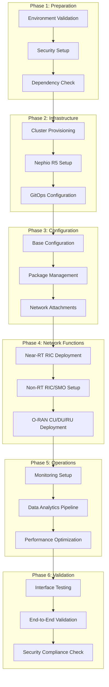
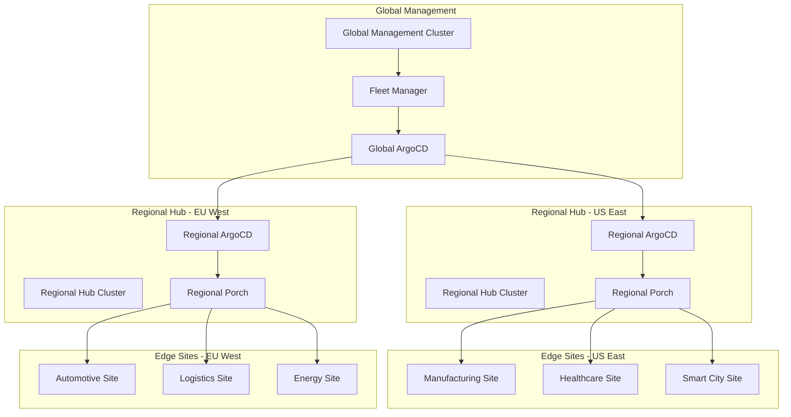
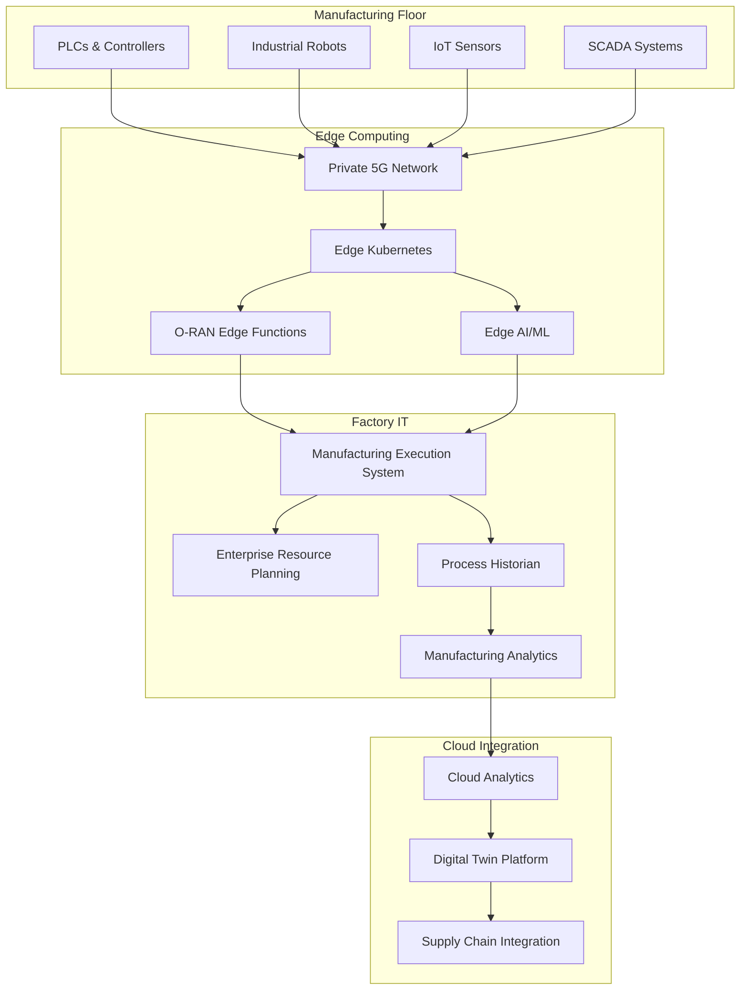

# Deployment Workflows

This guide provides comprehensive deployment workflows for different use cases and environments using the Nephio O-RAN Claude Agents system.

## 🚀 Standard Deployment Workflow

The standard deployment workflow follows a systematic approach to deploy a complete O-RAN L Release stack using Nephio R5 infrastructure.

### Workflow Overview



### Phase 1: Preparation

#### Environment Validation
```bash
# Use the dependency doctor agent for comprehensive validation
claude-agent dependency-doctor-agent "check dependencies"

# Validate all prerequisites
claude-agent dependency-doctor-agent "verify environment"
```

**Validates:**
- Go 1.24.6 installation and FIPS mode support
- Kubernetes cluster accessibility (v1.30+)
- Required CLI tools (kubectl, kpt, helm, argocd)
- Network connectivity and DNS resolution
- Storage and compute resource availability

#### Security Setup
```bash
# Apply initial security policies and FIPS mode
claude-agent security-compliance-agent "enforce_fips_mode"

# Set up WG11 security policies
claude-agent security-compliance-agent "apply_wg11_policies"

# Initialize zero-trust networking
claude-agent security-compliance-agent "apply_zero_trust_policies"
```

**Configures:**
- FIPS 140-3 cryptographic mode
- WG11 O-RAN security specifications
- Zero-trust network policies
- Initial RBAC and service accounts
- Certificate management setup

### Phase 2: Infrastructure

#### Cluster Provisioning
```bash
# Create management cluster
claude-agent infrastructure-agent "create cluster"

# Install Nephio R5 components
claude-agent infrastructure-agent "install nephio"

# Setup CNI and storage
claude-agent infrastructure-agent "setup networking"
claude-agent infrastructure-agent "setup storage"
```

**Deploys:**
- Kubernetes clusters (management + workload clusters)
- Nephio R5 core components (Porch, controllers)
- ArgoCD for GitOps automation
- CNI components (Multus, SR-IOV, Whereabouts)
- Storage solutions (OpenEBS, persistent volumes)

#### GitOps Configuration
```bash
# Configure ArgoCD and repositories
claude-agent orchestrator-agent "setup multi-cluster"

# Create package repositories
claude-agent orchestrator-agent "create package variants"
```

**Establishes:**
- ArgoCD ApplicationSets for multi-cluster deployment
- Git repositories for packages and configurations
- Porch package management integration
- Cross-cluster networking and security

### Phase 3: Configuration

#### Base Configuration
```bash
# Deploy base configurations via Porch
claude-agent config-management-agent "deploy package"

# Configure YANG models
claude-agent config-management-agent "configure yang"

# Setup network attachments
claude-agent config-management-agent "setup network"
```

**Configures:**
- Porch PackageRevisions and PackageVariants
- O-RAN YANG models validation and deployment
- Network attachment definitions for O-RAN interfaces
- Kpt function pipelines for customization

### Phase 4: Network Functions

#### Near-RT RIC Platform
```bash
# Deploy Near-RT RIC components
claude-agent network-functions-agent "deploy ric"

# Configure E2 interface
claude-agent network-functions-agent "configure e2"

# Deploy xApps
claude-agent network-functions-agent "deploy xapp"
```

**Deploys:**
- E2 Manager, E2 Termination, Subscription Manager
- A1 Mediator for policy enforcement
- Database services (Redis, SDL)
- xApps for specific use cases (KPIMon, Traffic Steering)

#### Non-RT RIC / SMO
```bash
# Deploy SMO components
claude-agent network-functions-agent "deploy smo"

# Configure A1 policies
claude-agent network-functions-agent "configure a1"

# Deploy rApps
claude-agent network-functions-agent "deploy rapp"
```

**Deploys:**
- Policy Management Service
- Information Coordination Service (ICS)
- rApp Catalogue and rApp Manager
- Control Panel and dashboards

#### O-RAN Network Functions
```bash
# Deploy O-RAN CU
claude-agent network-functions-agent "deploy cu"

# Deploy O-RAN DU
claude-agent network-functions-agent "deploy du"

# Deploy O-RU simulator (for testing)
claude-agent network-functions-agent "deploy ru"
```

**Deploys:**
- O-RAN Central Unit (CU) with F1/E1 interfaces
- O-RAN Distributed Unit (DU) with fronthaul interfaces
- O-RAN Radio Unit (RU) simulators for testing
- Network slice configurations

### Phase 5: Operations

#### Monitoring Setup
```bash
# Deploy Prometheus stack
claude-agent monitoring-analytics-agent "setup monitoring"

# Configure VES collector
claude-agent monitoring-analytics-agent "deploy ves"

# Import Grafana dashboards
claude-agent monitoring-analytics-agent "import dashboards"
```

**Establishes:**
- Prometheus metrics collection with O-RAN KPIs
- VES (Virtual Event Streaming) collector for 3GPP events
- Grafana dashboards for O-RAN visualization
- AlertManager for proactive alerting
- Jaeger for distributed tracing

#### Data Analytics Pipeline
```bash
# Setup data streaming
claude-agent data-analytics-agent "setup kafka"

# Deploy KPI calculator
claude-agent data-analytics-agent "deploy kpi calculator"

# Setup ML pipeline
claude-agent data-analytics-agent "setup ml pipeline"
```

**Deploys:**
- Kafka streaming platform with KRaft mode
- InfluxDB for time-series data storage
- Apache Flink for stream processing
- Kubeflow for ML/AI model management
- Data analytics dashboards (Superset)

#### Performance Optimization
```bash
# Analyze performance
claude-agent performance-optimization-agent "full_performance_check"

# Optimize energy efficiency
claude-agent performance-optimization-agent "optimize_ocloud_energy"

# Deploy AI models
claude-agent performance-optimization-agent "deploy_optimized_ai_models"
```

**Optimizes:**
- Resource allocation and HPA policies
- Energy efficiency targeting >0.5 Gbps/W
- AI/ML inference optimization (&lt;50ms P99)
- Network slice performance tuning
- Cross-cluster load balancing

### Phase 6: Validation

#### Interface Testing
```bash
# Test all O-RAN interfaces
claude-agent testing-validation-agent "test_e2_interface"
claude-agent testing-validation-agent "test_a1_interface"
claude-agent testing-validation-agent "test_o1_interface"
claude-agent testing-validation-agent "test_o2_interface"
```

**Validates:**
- E2 interface with RAN functions (KPM, RC, CCC)
- A1 interface policy enforcement
- O1 interface YANG/NETCONF operations
- O2 interface O-Cloud integration
- SMO integration functionality

#### End-to-End Validation
```bash
# Run complete test suite
claude-agent testing-validation-agent "run_complete_test_suite"

# Generate test report
claude-agent testing-validation-agent "generate_test_report"
```

**Tests:**
- Network slice end-to-end functionality
- Multi-cluster communication
- Performance benchmarks (latency, throughput)
- Fault tolerance and recovery
- Load testing and scalability

#### Security Compliance Check
```bash
# Final security audit
claude-agent security-compliance-agent "full_security_audit"

# Container vulnerability scan
claude-agent security-compliance-agent "scan_all_containers"
```

**Verifies:**
- WG11 O-RAN security compliance
- FIPS 140-3 cryptographic compliance
- Zero-trust network policy enforcement
- Container security and vulnerability management
- Audit logging and compliance reporting

## 🌍 Multi-Site Edge Deployment

For distributed edge computing scenarios across multiple geographical locations.

### Deployment Pattern



### Workflow Steps

1. **Global Management Setup**
   ```bash
   # Deploy global management cluster
   claude-agent orchestrator-agent "deploy global management"
   
   # Setup fleet management
   claude-agent infrastructure-agent "setup fleet management"
   ```

2. **Regional Hub Deployment**
   ```bash
   # Deploy regional hubs
   claude-agent orchestrator-agent "deploy regional hubs"
   
   # Configure cross-region networking
   claude-agent infrastructure-agent "setup cross-region networking"
   ```

3. **Edge Site Provisioning**
   ```bash
   # Create PackageVariantSet for edge sites
   claude-agent orchestrator-agent "create edge package variants"
   
   # Deploy edge-specific configurations
   claude-agent config-management-agent "deploy edge configurations"
   ```

4. **Edge Network Functions**
   ```bash
   # Deploy lightweight O-RAN components
   claude-agent network-functions-agent "deploy edge oran components"
   
   # Configure network slices per site
   claude-agent orchestrator-agent "deploy network slice urllc"
   ```

5. **Edge Monitoring & Analytics**
   ```bash
   # Setup distributed monitoring
   claude-agent monitoring-analytics-agent "setup edge monitoring"
   
   # Deploy edge AI/ML
   claude-agent data-analytics-agent "setup edge ml"
   ```

## 🏭 Industrial IoT Manufacturing

Specialized workflow for ultra-low latency manufacturing environments.

### Requirements
- **Latency**: &lt;1ms for critical control loops
- **Reliability**: 99.999% uptime
- **Security**: OT/IT convergence with strict isolation
- **Integration**: Existing MES/ERP systems

### Workflow



### Deployment Steps

1. **Industrial Infrastructure Setup**
   ```bash
   # Deploy ruggedized edge cluster
   claude-agent infrastructure-agent "create industrial cluster"
   
   # Configure OT/IT network segmentation
   claude-agent security-compliance-agent "setup industrial security"
   ```

2. **URLLC Network Slice**
   ```bash
   # Deploy ultra-low latency slice
   claude-agent orchestrator-agent "deploy network slice urllc"
   
   # Configure deterministic networking
   claude-agent config-management-agent "configure deterministic network"
   ```

3. **Manufacturing Integration**
   ```bash
   # Deploy manufacturing-specific O-RAN functions
   claude-agent network-functions-agent "deploy manufacturing oran"
   
   # Setup OPC-UA integration
   claude-agent config-management-agent "setup opcua integration"
   ```

4. **Predictive Maintenance AI**
   ```bash
   # Deploy edge AI for predictive maintenance
   claude-agent data-analytics-agent "deploy predictive maintenance"
   
   # Setup real-time anomaly detection
   claude-agent performance-optimization-agent "setup anomaly detection"
   ```

5. **Industrial Testing**
   ```bash
   # Run industrial-specific tests
   claude-agent testing-validation-agent "test industrial requirements"
   
   # Validate safety systems
   claude-agent testing-validation-agent "test safety validation"
   ```

## 🔬 Research & Development

Accelerated deployment for O-RAN research environments with rapid prototyping capabilities.

### Research Environment Features
- **Rapid Deployment**: &lt;15 minutes to full stack
- **Flexibility**: Easy component swapping and testing
- **Observability**: Comprehensive data collection
- **Experimentation**: A/B testing and chaos engineering

### Workflow

1. **Quick Stack Deployment**
   ```bash
   # One-command research deployment
   claude-agent orchestrator-agent "deploy research stack"
   
   # Enable development mode
   export ORAN_RESEARCH_MODE=true
   ```

2. **Experimental Configuration**
   ```bash
   # Deploy experimental xApps
   claude-agent network-functions-agent "deploy experimental xapp"
   
   # Setup A/B testing framework
   claude-agent testing-validation-agent "setup ab testing"
   ```

3. **Data Collection**
   ```bash
   # Enhanced data collection
   claude-agent data-analytics-agent "setup research analytics"
   
   # Export research data
   claude-agent data-analytics-agent "export research data"
   ```

4. **Chaos Engineering**
   ```bash
   # Run chaos experiments
   claude-agent testing-validation-agent "run chaos tests"
   
   # Analyze resilience patterns
   claude-agent performance-optimization-agent "analyze resilience"
   ```

## 🚧 Troubleshooting Workflows

### Common Deployment Issues

#### Issue: Package Deployment Failure
```bash
# Diagnose package issues
claude-agent dependency-doctor-agent "diagnose package failure"

# Check Porch status
kubectl get packagerevisions -A
kubectl logs -n porch-system -l app=porch-server

# Fix and retry
claude-agent config-management-agent "fix package deployment"
```

#### Issue: E2 Connection Problems
```bash
# Test E2 connectivity
claude-agent testing-validation-agent "test_e2_interface"

# Check E2Term logs
kubectl logs -n oran -l app=e2term

# Restart E2 components if needed
kubectl rollout restart deployment/e2term -n oran
```

#### Issue: Performance Below Targets
```bash
# Analyze performance
claude-agent performance-optimization-agent "full_performance_check"

# Identify bottlenecks
claude-agent monitoring-analytics-agent "analyze performance bottlenecks"

# Apply optimizations
claude-agent performance-optimization-agent "quick_optimize oran"
```

### Recovery Procedures

#### Complete Deployment Recovery
```bash
# Save current state
claude-agent orchestrator-agent "backup current state"

# Identify failure point
claude-agent dependency-doctor-agent "analyze failure"

# Rollback to known good state
claude-agent orchestrator-agent "rollback to last known good"

# Re-run failed phase
claude-agent orchestrator-agent "resume deployment from infrastructure"
```

---

## Best Practices

### 1. Pre-deployment Validation
- Always run dependency checks first
- Validate network connectivity and DNS
- Ensure sufficient resources are available
- Check security compliance requirements

### 2. Phased Deployment
- Follow the standard workflow phases
- Validate each phase before proceeding
- Maintain rollback points at phase boundaries
- Monitor system health during deployment

### 3. Monitoring Integration
- Set up monitoring early in the deployment
- Configure alerts for critical components
- Establish baseline performance metrics
- Implement health checks for all services

### 4. Security First
- Apply security policies from the beginning
- Use FIPS-compliant cryptography
- Implement zero-trust networking
- Regular security scanning and audits

### 5. Documentation and Logging
- Document all configuration changes
- Maintain deployment logs and artifacts
- Create runbooks for operational procedures
- Keep security and compliance documentation current

These workflows provide a solid foundation for deploying O-RAN networks using the Nephio O-RAN Claude Agents system across various use cases and environments.