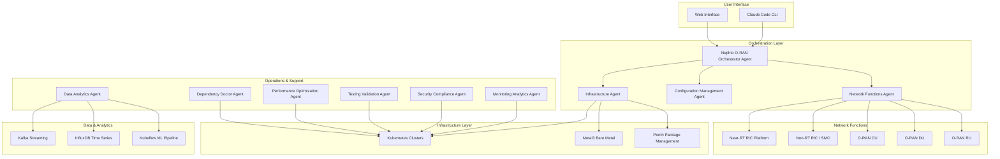

# Nephio O-RAN Claude Agents

Welcome to the **Nephio O-RAN Claude Agents** project - an advanced cloud-native orchestration system that bridges natural language network operations with O-RAN compliant deployments using cutting-edge AI agents.

## 🎯 Project Mission

The Nephio O-RAN Claude Agents project provides intelligent automation for deploying, managing, and optimizing O-RAN L Release networks using Nephio R5 infrastructure. Our AI-powered agents understand natural language commands and execute complex network operations with precision and reliability.

## 🏗️ System Architecture

Our system consists of 10 specialized agents that work together to provide comprehensive O-RAN network lifecycle management:



## 🚀 Key Features

### 🤖 Intelligent Agent System
- **10 Specialized Agents**: Each agent is an expert in a specific domain
- **Natural Language Processing**: Understand and execute commands in plain English
- **Autonomous Operation**: Agents can work independently or collaboratively
- **Self-Healing**: Automatic detection and resolution of issues

### 🌐 O-RAN L Release Compliance
- **Complete Interface Support**: E2, A1, O1, O2 interfaces fully implemented
- **WG11 Security Standards**: Advanced security and compliance validation
- **SMO Integration**: Full Service Management and Orchestration support
- **RAN Functions**: KPM, RC, and CCC RAN function support

### ☸️ Nephio R5 Integration
- **Porch Package Management**: Advanced GitOps-based package orchestration
- **PackageVariantSet**: Multi-cluster deployment automation
- **O-Cloud Integration**: Cloud-native infrastructure management
- **FIPS 140-3 Compliance**: Secure cryptographic operations with Go 1.24.6

### 🔧 Advanced Automation
- **Infrastructure as Code**: Declarative infrastructure management
- **GitOps Workflows**: ArgoCD and Flux-based continuous deployment
- **Zero-Downtime Operations**: Blue-green and canary deployments
- **Multi-Cluster Management**: Seamless operation across edge and core

## 📋 Agent Inventory

| Agent | Purpose | Model | Capabilities |
|-------|---------|-------|--------------|
| [**Orchestrator Agent**](./orchestration/nephio-oran-orchestrator-agent.md) | Master coordinator | Claude Opus | Multi-cluster deployment, workflow management, package variant orchestration |
| [**Infrastructure Agent**](./infrastructure/nephio-infrastructure-agent.md) | Infrastructure provisioning | Claude Sonnet | Kind/Metal3 clusters, Nephio R5 components, ArgoCD, storage |
| [**Configuration Management Agent**](./config-management/configuration-management-agent.md) | Configuration deployment | Claude Haiku | Porch packages, YANG models, network attachments, kpt functions |
| [**Network Functions Agent**](./network-functions/oran-network-functions-agent.md) | O-RAN network functions | Claude Haiku | Near-RT RIC, SMO, xApps, rApps, CU/DU/RU deployment |
| [**Monitoring Analytics Agent**](./monitoring/monitoring-analytics-agent.md) | Observability stack | Claude Sonnet | Prometheus, Grafana, VES collector, Jaeger tracing |
| [**Data Analytics Agent**](./analytics/data-analytics-agent.md) | Data processing | Claude Sonnet | Kafka streaming, InfluxDB, Flink processing, ML pipelines |
| [**Security Compliance Agent**](./security/security-compliance-agent.md) | Security validation | Claude Sonnet | WG11 compliance, FIPS mode, container scanning, zero-trust |
| [**Performance Optimization Agent**](./performance/performance-optimization-agent.md) | Performance tuning | Claude Opus | SMO optimization, energy efficiency, AI/ML acceleration |
| [**Testing Validation Agent**](./testing/testing-validation-agent.md) | End-to-end testing | Claude Haiku | Interface testing, chaos engineering, load testing, Go coverage |
| [**Dependency Doctor Agent**](./infrastructure/oran-nephio-dep-doctor-agent.md) | Dependency resolution | Claude Sonnet | Go modules, Python packages, system libraries, container fixes |

## 🎯 Use Cases

### 🏢 Enterprise 5G Deployment
Deploy a complete private 5G network with O-RAN components for enterprise use cases:
- Automated infrastructure provisioning
- Security-first deployment with WG11 compliance
- Performance optimization for specific workloads
- Continuous monitoring and analytics

### 🌍 Multi-Site Edge Computing
Manage distributed edge computing infrastructure across multiple sites:
- PackageVariantSet for site-specific configurations
- Energy-efficient operations with sustainability metrics
- AI/ML workload placement and optimization
- Zero-touch provisioning and maintenance

### 🔬 Research & Development
Accelerate O-RAN research with rapid prototyping capabilities:
- Quick deployment of test environments
- Chaos engineering for resilience testing
- Custom xApp and rApp development workflows
- Comprehensive performance benchmarking

### 🏭 Industrial IoT & Manufacturing
Deploy industrial-grade 5G networks for manufacturing and IoT:
- Ultra-low latency network slice management
- Predictive maintenance with AI/ML analytics
- Strict security and compliance requirements
- Integration with existing industrial systems

## 🚀 Quick Start

### Prerequisites
- Kubernetes 1.30+
- Go 1.24.6 (with FIPS 140-3 support)
- Docker/Podman
- Helm 3.x
- kubectl and kpt CLI tools

### 1-Minute Demo
```bash
# Clone the repository
git clone https://github.com/your-org/nephio-oran-claude-agents.git
cd nephio-oran-claude-agents

# Start with infrastructure setup
claude-agent infrastructure-agent "create cluster"

# Deploy O-RAN components
claude-agent network-functions-agent "deploy ric"

# Monitor the deployment
claude-agent monitoring-agent "setup monitoring"

# Validate everything works
claude-agent testing-validation-agent "quick validation"
```

### Standard Deployment Workflow
1. **Infrastructure Setup**: Create Kubernetes clusters with Nephio R5
2. **Security Configuration**: Apply WG11 security policies and FIPS mode
3. **Network Function Deployment**: Deploy O-RAN components via Porch packages
4. **Monitoring & Analytics**: Set up observability and data processing
5. **Performance Optimization**: Apply energy efficiency and AI/ML optimizations
6. **Validation & Testing**: Run comprehensive E2E test suites

## 📊 System Requirements

### Minimum Requirements
- **CPU**: 16 cores
- **Memory**: 64GB RAM
- **Storage**: 500GB SSD
- **Network**: 10Gbps connectivity

### Recommended for Production
- **CPU**: 32+ cores with SR-IOV support
- **Memory**: 128GB+ RAM
- **Storage**: 2TB+ NVMe SSD
- **Network**: 25Gbps+ with DPDK support
- **GPU**: NVIDIA A100 or equivalent for AI/ML workloads

## 🔧 Technology Stack

### Core Technologies
- **Container Platform**: Kubernetes 1.30+, containerd
- **Package Management**: Helm, kpt, Porch
- **GitOps**: ArgoCD, Flux
- **Service Mesh**: Istio (optional)
- **Storage**: OpenEBS, Rook-Ceph

### O-RAN Components
- **Near-RT RIC**: O-RAN SC platform v3.0.0+
- **Non-RT RIC/SMO**: O-RAN SC Non-RT RIC v2.5.0+
- **E2 Interface**: ASN.1 based with RAN functions
- **A1 Interface**: RESTful policy management
- **O1 Interface**: NETCONF/YANG configuration

### Data & Analytics
- **Streaming**: Apache Kafka with KRaft
- **Time Series**: InfluxDB 2.x
- **Processing**: Apache Flink
- **ML/AI**: Kubeflow, KServe, ONNX Runtime
- **Visualization**: Grafana, Superset

### Security & Compliance
- **Cryptography**: FIPS 140-3 with Go 1.24.6
- **Network Security**: Calico, Network Policies
- **Container Security**: Falco, Trivy scanning
- **Secret Management**: External Secrets Operator

## 📚 Documentation Structure

This documentation is organized into the following sections:

- **[Getting Started](./guides/quickstart.md)**: Quick setup and basic operations
- **[Architecture](./architecture/)**: System design and component interactions
- **[Agents](./agents/)**: Individual agent documentation and capabilities
- **[Integration](./integration/)**: Workflow guides and best practices
- **[API Reference](./api/)**: Complete API documentation
- **[Examples](./examples/)**: Real-world usage scenarios
- **[Troubleshooting](./troubleshooting/)**: Common issues and solutions

## 🤝 Community & Support

### Getting Help
- **Documentation**: Comprehensive guides and API references
- **GitHub Issues**: Bug reports and feature requests
- **Community Slack**: Real-time discussion and support
- **Office Hours**: Weekly community calls

### Contributing
We welcome contributions from the community! Whether it's:
- Bug reports and fixes
- New agent capabilities
- Documentation improvements
- Performance optimizations
- Security enhancements

Please see our [Contributing Guide](./CONTRIBUTING.md) for details on how to get started.

### Roadmap
Our development roadmap includes:
- **Q4 2024**: O-RAN L Release full compliance
- **Q1 2025**: Advanced AI/ML integration
- **Q2 2025**: Multi-cloud deployment support
- **Q3 2025**: Edge computing optimizations
- **Q4 2025**: 6G research integration

## ⚡ Performance Benchmarks

| Metric | Target | Typical |
|--------|--------|---------|
| E2 Setup Time | < 5 seconds | 2.3s |
| A1 Policy Deployment | < 2 seconds | 0.8s |
| Package Deployment | < 30 seconds | 18s |
| AI/ML Inference (P99) | < 50ms | 42ms |
| Energy Efficiency | > 0.5 Gbps/W | 0.73 Gbps/W |
| Test Coverage | > 85% | 87.3% |

## 🔐 Security & Compliance

- **FIPS 140-3**: Cryptographic module validation
- **WG11 Standards**: O-RAN security specifications
- **Zero Trust**: Network security architecture
- **RBAC**: Role-based access control
- **Audit Logging**: Comprehensive security event logging
- **Vulnerability Scanning**: Continuous container and dependency scanning

## 📈 Monitoring & Observability

- **Real-time Metrics**: Prometheus with custom O-RAN metrics
- **Distributed Tracing**: Jaeger for end-to-end request tracing
- **Log Aggregation**: Fluentd with ELK stack
- **Alerting**: AlertManager with PagerDuty integration
- **Dashboards**: Pre-built Grafana dashboards for O-RAN KPIs

---

## Next Steps

Ready to get started? Here are some suggested next steps:

1. **[Quick Start Guide](./guides/quickstart.md)** - Get up and running in minutes
2. **[Architecture Overview](./architecture/)** - Understand the system design
3. **[Agent Documentation](./agents/)** - Learn about individual agent capabilities
4. **[API Reference](./api/)** - Integrate with our APIs
5. **[Examples](./examples/)** - See real-world usage scenarios

Welcome to the future of automated O-RAN network operations! 🚀
