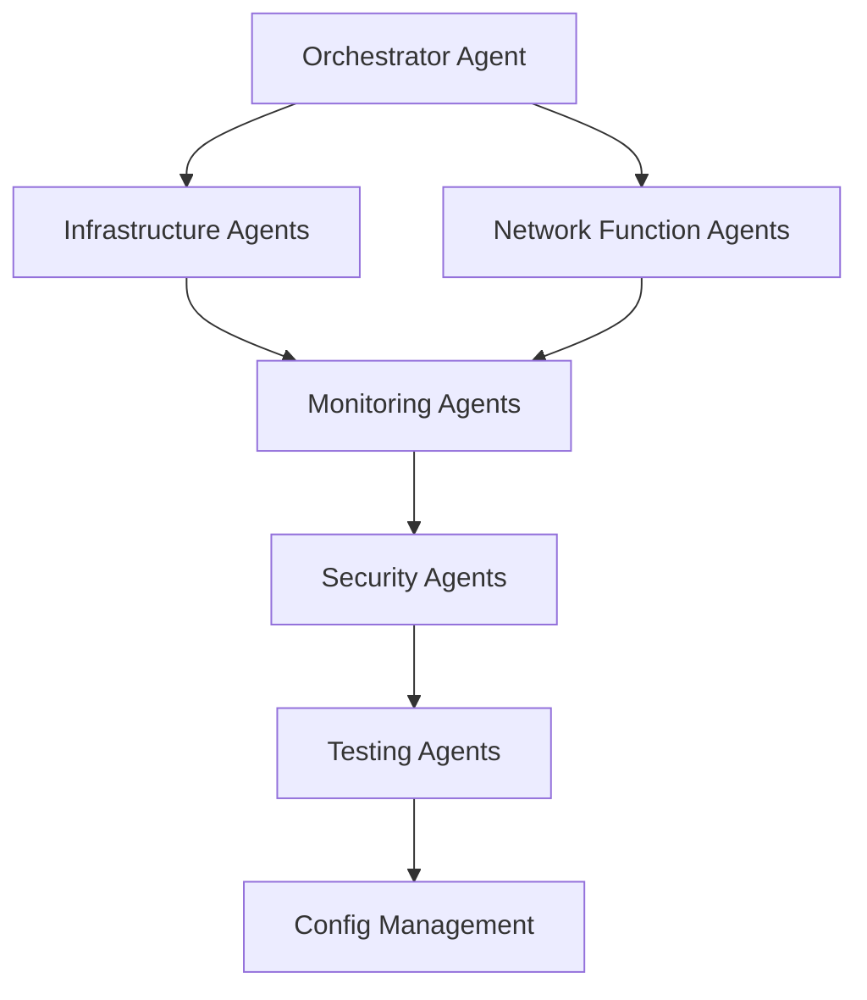

# Nephio O-RAN Claude Agents

Welcome to the **Nephio O-RAN Claude Agents** documentation! This project provides intelligent orchestration capabilities for cloud-native O-RAN deployments using Claude AI agents.

## What are Nephio O-RAN Claude Agents?

Nephio O-RAN Claude Agents are AI-powered automation tools that help orchestrate, manage, and optimize O-RAN (Open Radio Access Network) deployments on Kubernetes using the Nephio platform. These agents leverage Claude AI to provide intelligent decision-making, automated troubleshooting, and streamlined operations for complex cloud-native telecommunications infrastructure.

## Key Features

### 🤖 Intelligent Automation

- **AI-Powered Decision Making**: Claude agents analyze system state and make intelligent operational decisions
- **Automated Troubleshooting**: Proactive issue detection and resolution
- **Self-Healing Infrastructure**: Automatic recovery from common failure scenarios

### 🏗️ Comprehensive Coverage

- **Orchestration Management**: End-to-end deployment orchestration
- **Infrastructure Operations**: Automated infrastructure provisioning and scaling
- **Network Function Lifecycle**: Complete management of O-RAN network functions
- **Security & Compliance**: Continuous security monitoring and compliance enforcement

### 🔧 Production Ready

- **Enterprise Grade**: Built for production O-RAN deployments
- **Kubernetes Native**: Seamlessly integrates with Kubernetes and Nephio
- **GitOps Enabled**: Full GitOps workflow support
- **Multi-Cloud Ready**: Deploy across multiple cloud environments

## Agent Categories

Our agent ecosystem is organized into specialized categories:

### 🎯 Orchestration Agents

- **Nephio O-RAN Orchestrator Agent**: Central orchestration and coordination

### 🏭 Infrastructure Agents  

- **Nephio Infrastructure Agent**: Infrastructure provisioning and management
- **O-RAN Nephio Dependency Doctor Agent**: Dependency analysis and resolution

### 📊 Monitoring & Analytics Agents

- **Monitoring Analytics Agent**: Real-time monitoring and alerting
- **Data Analytics Agent**: Performance analytics and insights
- **Performance Optimization Agent**: Automated performance tuning

### 🔐 Security & Compliance Agents

- **Security Compliance Agent**: Security policy enforcement and compliance monitoring

### 🌐 Network Functions Agents

- **O-RAN Network Functions Agent**: Network function lifecycle management

### 🧪 Testing & Validation Agents

- **Testing Validation Agent**: Automated testing and validation workflows

### ⚙️ Configuration Management Agents

- **Configuration Management Agent**: Configuration drift detection and remediation

## Technology Stack

### Core Technologies

- **Go Version**: 1.24.6
- **Kubernetes**: latest three minor releases
- **Nephio**: R5 (v5.0.0)
- **KPT**: v1.0.0-beta.55

### O-RAN Specifications

- **O-RAN Release**: 2025-06-30
- **Security**: FIPS 140-3 compliant
- **Standards**: Full O-RAN Alliance compliance

## Getting Started

### Prerequisites

- Kubernetes cluster (v1.25+)
- Nephio R5 installed
- KPT v1.0.0-beta.55+
- Go 1.24.6+

### Quick Start

1. **Clone the repository**

   ```bash
   git clone https://github.com/thc1006/nephio-oran-claude-agents.git
   ```

2. **Install dependencies**

   ```bash
   cd nephio-oran-claude-agents
   make install
   ```

3. **Deploy agents**

   ```bash
   make deploy
   ```

4. **Verify deployment**

   ```bash
   kubectl get pods -n nephio-agents
   ```

## Architecture Overview

The Nephio O-RAN Claude Agents follow a distributed, event-driven architecture:



### Key Principles

- **Microservices Architecture**: Each agent is independently deployable
- **Event-Driven Communication**: Agents communicate through Kubernetes events
- **GitOps Workflow**: All configuration managed through Git
- **Cloud-Native Design**: Built for Kubernetes from the ground up

## Support and Community

### Documentation

- [Agent Reference](/docs/agents/)
- [Configuration Guides](/docs/guides/)
- [API Documentation](https://github.com/thc1006/nephio-oran-claude-agents/blob/main/docs/)

### Community Resources

- [GitHub Repository](https://github.com/thc1006/nephio-oran-claude-agents)
- [Nephio Community](https://github.com/nephio-project)
- [O-RAN Alliance](https://www.o-ran.org/)

### Getting Help

- Review the [Compatibility Matrix](https://github.com/thc1006/nephio-oran-claude-agents/blob/main/COMPATIBILITY_MATRIX.md)
- Check existing [GitHub Issues](https://github.com/thc1006/nephio-oran-claude-agents/issues)
- Join the Nephio community discussions

---

Ready to get started? Explore our [agent documentation](/docs/orchestration/nephio-oran-orchestrator-agent) or check out the [quick start guide](/docs/guides/quickstart)!
