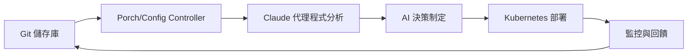

# 核心概念與架構

歡迎來到核心概念章節！這份全面的指南將幫助您了解 Nephio O-RAN Claude Agents 背後的基本原則、架構和設計決策。

## 概述

Nephio O-RAN Claude Agents 代表了網路功能編排的革命性方法，結合了 Claude AI 的強大功能與 Nephio 的 Kubernetes 原生平台的靈活性。本節探討使這種整合成為可能的關鍵概念。

## 基本概念

### 智能代理系統架構

我們的代理系統建構於幾個核心原則之上：

- **AI 驅動決策制定**：每個智能代理利用 Claude AI 對網路功能部署和管理做出智慧決策
- **Kubernetes 原生**：與 Kubernetes 和 Nephio 的 GitOps 工作流程完全整合
- **事件驅動架構**：回應叢集事件和變化的反應式系統
- **宣告式配置**：基礎架構和網路功能定義為程式碼

### 代理系統類型和角色

#### 🎼 編排代理系統
- **主要角色**：高層工作流程協調
- **關鍵功能**：部署規劃、資源分配、相依性管理
- **範例**：Nephio O-RAN 編排代理程式

#### 🏗️ 基礎設施代理系統
- **主要角色**：叢集和基礎架構管理
- **關鍵功能**：節點佈建、網路配置、資源監控
- **範例**：基礎設施代理系統、部署診斷代理系統

#### 📊 資料分析與監控代理系統
- **主要角色**：資料收集、分析和可觀測性
- **關鍵功能**：效能監控、異常偵測、容量規劃
- **範例**：資料分析代理系統、網路監控代理系統

#### ⚙️ 組態管理代理系統
- **主要角色**：配置生命週期管理
- **關鍵功能**：組態驗證、組態飄移偵測、法規遵循檢查
- **範例**：組態管理代理系統

#### 🛡️ 資安與法規遵循代理系統
- **主要角色**：安全姿態管理
- **關鍵功能**：資安政策執行、弱點掃描、法規遵循報告
- **範例**：資安法規代理系統

## 架構原則

### 雲端原生設計

我們的架構遵循雲端原生設計原則：

```yaml
apiVersion: v1
kind: ConfigMap
metadata:
  name: agent-principles
data:
  scalability: "使用 Kubernetes 進行水平擴展"
  resilience: "自我修復和容錯"
  observability: "全面的指標和日誌記錄"
  security: "零信任安全模型"
```

### AI 整合模式

#### 提示詞工程
- **結構化提示詞**：一致的輸入格式以獲得可靠的 AI 回應
- **情境感知**：智能代理了解當前的叢集狀態和歷史資訊
- **決策透明度**：AI 推理被記錄並可審核

#### 回饋機制
- **從結果學習**：智能代理根據部署結果持續改進決策能力
- **持續最佳化**：效能指標指導未來的 AI 建議
- **人在迴路中**：關鍵決策可能需要人工核准

## O-RAN 整合

### O-RAN 架構對齊

我們的智能代理系統設計為與 O-RAN 架構無縫整合：

#### 近實時 RIC (nRT-RIC)
- **xApp 管理**：xApp 的智能部署和全生命週期管理
- **政策協調**：與 RAN 智能控制器的無縫整合
- **效能最佳化**：AI 驅動的資源分配以獲得最佳效能

#### 非即時 RIC (Non-RT RIC)
- **rApp 編排**：RAN 應用程式的協調部署
- **服務管理**：端到端服務生命週期管理
- **資料分析**：與 SMO 資料湖和分析平台整合

#### O-Cloud 基礎架構
- **資源管理**：計算、儲存和網路資源的智慧分配
- **多租戶**：支援共享基礎架構上的多個 O-RAN 部署
- **邊緣運算**：分散式邊緣部署場景的最佳化

### 介面標準

我們的代理程式支援關鍵的 O-RAN 介面：

- **A1 介面**：政策與資訊增強交換
- **E2 介面**：近即時控制與監控
- **O1 介面**：操作、管理和維護 (OAM)
- **O2 介面**：O-Cloud 基礎架構管理

## Nephio 整合

### GitOps 工作流程



### 套件式管理

- **KPT 套件**：組態以版本控制套件形式分發
- **套件變體**：特定於環境的自訂
- **依賴性管理**：套件間依賴關係的自動化處理

### 資源協調

- **客製化資源**：專為 O-RAN 網路元件設計的 Nephio 自定義資源定義
- **控制器**：擴展了 AI 功能的 Kubernetes 控制器
- **營運商**：複雜網路功能的專用營運管理系統

## 資料流程和狀態管理

### 狀態同步化

```yaml
# 範例：智能代理狀態協調
apiVersion: agents.nephio.org/v1
kind: AgentCoordination
metadata:
  name: oran-deployment-coordination
spec:
  agents:
    - name: orchestrator-agent
      role: primary
      responsibilities: ["planning", "coordination"]
    - name: infrastructure-agent
      role: secondary
      responsibilities: ["resource-validation", "capacity-check"]
    - name: monitoring-agent
      role: observer
      responsibilities: ["metrics-collection", "alerting"]
```

### 事件驅動通信

- **Kubernetes 事件**：智能代理通信的原生事件系統
- **自訂事件**：O-RAN 操作的特定領域事件
- **事件關聯**：AI 驅動的事件分析和關聯

## 安全模型

### 零信任架構

- **身分驗證**：每個智能代理請求都經過身分驗證和權限授權
- **網路隔離**：智能代理在隔離的網路區段中運作
- **最小權限原則**：每個智能代理僅擁有執行任務所需的最小權限

### AI 安全考量

- **提示詞注入防護**：防範惡意提示詞操控的資安防護措施
- **決策可稽核性**：所有 AI 決策都會被記錄並可進行稽核追蹤
- **偏誤偵測**：監控 AI 決策制定過程中的演算法偏誤

## 效能和可擴充性

### 水平擴展

```yaml
apiVersion: apps/v1
kind: Deployment
metadata:
  name: claude-agent
spec:
  replicas: 3  # 根據工作負載擴展
  template:
    spec:
      containers:
      - name: agent
        resources:
          requests:
            memory: "256Mi"
            cpu: "250m"
          limits:
            memory: "512Mi"
            cpu: "500m"
```

### 資源最佳化

- **智能批次處理**：將相似操作分組批次處理以提升執行效率
- **快取策略**：對經常存取的資料和 AI 回應進行快取處理
- **資源共用池**：智能代理實例間的資源共用機制

## 部署模式

### 多重環境支援

- **開發環境**：用於測試和開發的輕量級智能代理
- **預備環境**：用於正式上線前驗證的全功能智能代理
- **正式環境**：用於正式營運部署的高可用性、高資安智能代理

### 高可用性

- **代理系統備援**：多個智能代理實例確保容錯能力
- **狀態複寫**：智能代理實例間的狀態同步複寫
- **優雅降級**：當 AI 服務不可用時的備援模式

## 監控和可觀測性

### 全面指標

```yaml
# 透過 Prometheus 公開的智能代理指標
- agent_decisions_total{agent="orchestrator", outcome="success"}
- agent_response_time_seconds{agent="monitoring", operation="health_check"}
- agent_ai_tokens_used{agent="infrastructure", model="claude"}
```

### 分散式追蹤

- **端對端追蹤**：追蹤所有智能代理互動間的請求流程
- **效能分析**：識別智能代理工作流程中的效能瓶頸
- **錯誤關聯分析**：將錯誤事件關聯到特定的智能代理決策

## 下一步

現在您了解了核心概念，請探索這些領域：

### 深入主題

1. **智能代理架構** - 詳細技術架構說明
2. **系統整合模式** - 智能代理如何與現有電信系統整合
3. **API 參考** - 完整的 API 文件

### 實際應用

1. **範例** - 真實世界的部署場景
2. **疑難排解** - 常見問題和解決方案
3. **智能代理指南** - 個別智能代理系統文件

## 社群和貢獻

### 對核心概念的貢獻

- **文件**：協助改進概念說明
- **範例**：貢獻真實世界的使用案例
- **回饋**：分享您的經驗和建議

### 研究與開發

- **AI 功能強化**：為智能代理系統的 AI 能力提升做出貢獻
- **效能最佳化**：協助最佳化智能代理系統效能
- **新模式**：開發新的整合模式

---

*這些核心概念構成了 Nephio O-RAN Claude 智能代理系統的基礎。深入理解這些概念將幫助您有效地部署和管理智能化網路功能。*

*最後更新：2025年8月*