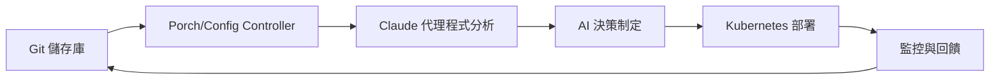

# 核心概念與架構

歡迎來到核心概念章節！這份全面的指南將幫助您了解 Nephio O-RAN Claude Agents 背後的基本原則、架構和設計決策。

## 概述

Nephio O-RAN Claude Agents 代表了網路功能編排的革命性方法，結合了 Claude AI 的強大功能與 Nephio 的 Kubernetes 原生平台的靈活性。本節探討使這種整合成為可能的關鍵概念。

## 基本概念

### 智慧代理程式架構

我們的代理程式建構於幾個核心原則之上：

- **AI 驅動決策制定**：每個代理程式利用 Claude AI 對網路功能部署和管理做出智慧決策
- **Kubernetes 原生**：與 Kubernetes 和 Nephio 的 GitOps 工作流程完全整合
- **事件驅動架構**：回應叢集事件和變化的反應式系統
- **宣告式配置**：基礎架構和網路功能定義為程式碼

### 代理程式類型和角色

#### 🎼 編排代理程式
- **主要角色**：高層工作流程協調
- **關鍵功能**：部署規劃、資源分配、相依性管理
- **範例**：[Nephio O-RAN 編排代理程式](../orchestration/nephio-oran-orchestrator-agent.md)

#### 🏗️ 基礎架構代理程式
- **主要角色**：叢集和基礎架構管理
- **關鍵功能**：節點佈建、網路配置、資源監控
- **範例**：[基礎架構代理程式](../infrastructure/nephio-infrastructure-agent.md)、[部署診斷代理程式](../infrastructure/oran-nephio-dep-doctor-agent.md)

#### 📊 分析和監控代理程式
- **主要角色**：資料收集、分析和可觀測性
- **關鍵功能**：效能監控、異常偵測、容量規劃
- **範例**：[資料分析代理程式](../analytics/data-analytics-agent.md)、[監控代理程式](../monitoring/monitoring-analytics-agent.md)

#### ⚙️ 配置管理代理程式
- **主要角色**：配置生命週期管理
- **關鍵功能**：配置驗證、偏移偵測、合規檢查
- **範例**：[配置管理代理程式](../config-management/configuration-management-agent.md)

#### 🛡️ 安全性和合規性代理程式
- **主要角色**：安全姿態管理
- **關鍵功能**：政策執行、漏洞掃描、合規報告
- **範例**：[安全合規代理程式](../security/security-compliance-agent.md)

## 架構原則

### 雲原生設計

我們的架構遵循雲原生原則：

```yaml
apiVersion: v1
kind: ConfigMap
metadata:
  name: agent-principles
data:
  scalability: "使用 Kubernetes 進行水平擴展"
  resilience: "自我修復和容錯"
  observability: "全面的指標和日誌記錄"
  security: "零信任安全模型"
```

### AI 整合模式

#### 提示工程
- **結構化提示**：一致的輸入格式以獲得可靠的 AI 回應
- **情境感知**：代理程式了解目前的叢集狀態和歷史
- **決策透明度**：AI 推理被記錄並可審核

#### 反饋循環
- **從結果學習**：代理程式根據部署結果改進決策
- **持續最佳化**：效能指標指導未來的 AI 建議
- **人在迴路中**：關鍵決策可能需要人工核准

## O-RAN 整合

### O-RAN 架構對齊

我們的代理程式設計為與 O-RAN 架構無縫協作：

#### 近實時 RIC (nRT-RIC)
- **xApp 管理**：xApp 的智慧部署和生命週期管理
- **政策協調**：與 RAN 智慧控制器的無縫整合
- **效能最佳化**：AI 驅動的資源分配以獲得最佳效能

#### 非實時 RIC (Non-RT RIC)
- **rApp 編排**：RAN 應用程式的協調部署
- **服務管理**：端到端服務生命週期管理
- **資料分析**：與 SMO 資料湖和分析平台整合

#### O-Cloud 基礎架構
- **資源管理**：計算、儲存和網路資源的智慧分配
- **多租戶**：支援共享基礎架構上的多個 O-RAN 部署
- **邊緣運算**：分散式邊緣部署場景的最佳化

### 介面標準

我們的代理程式支援關鍵的 O-RAN 介面：

- **A1 介面**：政策和豐富資訊交換
- **E2 介面**：近實時控制和監控
- **O1 介面**：操作、管理和維護 (OAM)
- **O2 介面**：O-Cloud 基礎架構管理

## Nephio 整合

### GitOps 工作流程



### 基於套件的管理

- **KPT 套件**：配置以版本化套件形式分發
- **套件變體**：特定於環境的自訂
- **相依性管理**：套件相依性的自動處理

### 資源編排

- **自訂資源**：O-RAN 元件的 Nephio 特定 CRD
- **控制器**：擴展了 AI 功能的 Kubernetes 控制器
- **操作員**：複雜網路功能的專用操作員

## 資料流程和狀態管理

### 狀態同步

```yaml
# 範例：代理程式狀態協調
apiVersion: agents.nephio.org/v1
kind: AgentCoordination
metadata:
  name: oran-deployment-coordination
spec:
  agents:
    - name: orchestrator-agent
      role: primary
      responsibilities: ["planning", "coordination"]
    - name: infrastructure-agent
      role: secondary
      responsibilities: ["resource-validation", "capacity-check"]
    - name: monitoring-agent
      role: observer
      responsibilities: ["metrics-collection", "alerting"]
```

### 事件驅動通訊

- **Kubernetes 事件**：代理程式通訊的原生事件系統
- **自訂事件**：O-RAN 操作的特定領域事件
- **事件關聯**：AI 驅動的事件分析和關聯

## 安全模型

### 零信任架構

- **身分驗證**：每個代理程式請求都經過驗證和授權
- **網路分割**：代理程式在隔離的網路段中運作
- **最小權限**：每個代理程式的最小必要權限

### AI 安全考量

- **提示注入保護**：防範惡意提示操控的保護措施
- **決策可審核性**：所有 AI 決策都被記錄並可審核
- **偏見偵測**：監控決策制定過程中的 AI 偏見

## 效能和可擴充性

### 水平擴展

```yaml
apiVersion: apps/v1
kind: Deployment
metadata:
  name: claude-agent
spec:
  replicas: 3  # 根據工作負載擴展
  template:
    spec:
      containers:
      - name: agent
        resources:
          requests:
            memory: "256Mi"
            cpu: "250m"
          limits:
            memory: "512Mi"
            cpu: "500m"
```

### 資源最佳化

- **智慧批處理**：將相似操作分組以提高效率
- **快取策略**：快取經常存取的資料和 AI 回應
- **資源池**：代理程式實例間共享資源

## 部署模式

### 多環境支援

- **開發**：用於測試和開發的輕量級代理程式
- **暫存**：用於生產前驗證的全功能代理程式
- **生產**：用於即時部署的高可用性、安全代理程式

### 高可用性

- **代理程式冗餘**：多個代理程式實例以實現容錯
- **狀態複製**：代理程式實例間的共享狀態
- **優雅降級**：當 AI 服務不可用時的備援模式

## 監控和可觀測性

### 全面指標

```yaml
# 透過 Prometheus 公開的代理程式指標
- agent_decisions_total{agent="orchestrator", outcome="success"}
- agent_response_time_seconds{agent="monitoring", operation="health_check"}
- agent_ai_tokens_used{agent="infrastructure", model="claude"}
```

### 分散式追蹤

- **端到端追蹤**：追蹤所有代理程式互動間的請求
- **效能分析**：識別代理程式工作流程中的瓶頸
- **錯誤關聯**：將錯誤連結到特定的代理程式決策

## 下一步

現在您了解了核心概念，請探索這些領域：

### 深入主題

1. **[代理程式架構](../architecture/index.md)** - 詳細技術架構
2. **[整合模式](../integration/index.md)** - 代理程式如何與現有系統整合
3. **[API 參考](../04-api-reference/index.md)** - 完整的 API 文件

### 實際應用

1. **[範例](../examples/index.md)** - 真實世界的部署場景
2. **[疑難排解](../07-troubleshooting/index.md)** - 常見問題和解決方案
3. **[代理程式指南](../agents/index.md)** - 個別代理程式文件

## 社群和貢獻

### 對核心概念的貢獻

- **文件**：協助改進概念說明
- **範例**：貢獻真實世界的使用案例
- **回饋**：分享您的經驗和建議

### 研究與開發

- **AI 增強**：為代理程式智慧改進做出貢獻
- **效能最佳化**：協助最佳化代理程式效能
- **新模式**：開發新的整合模式

---

*這些概念構成了 Nephio O-RAN Claude Agents 的基礎。了解它們將幫助您有效地部署和管理智慧網路功能。*

*最後更新：2025年8月*