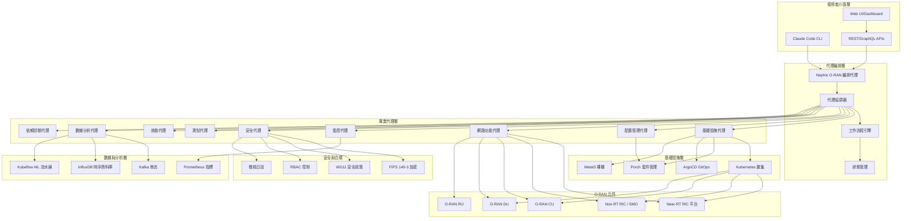
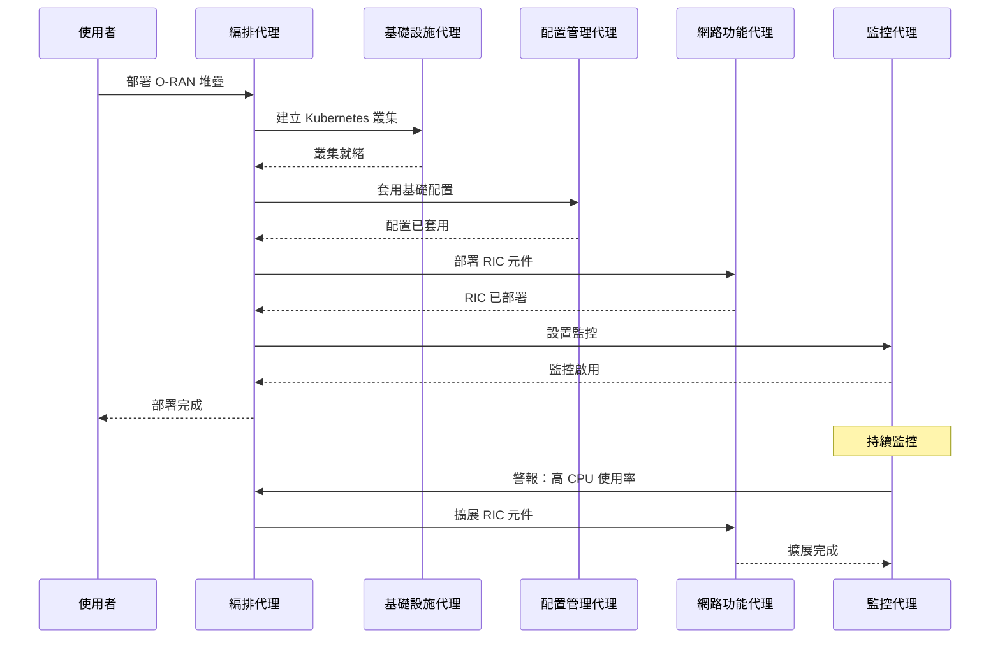
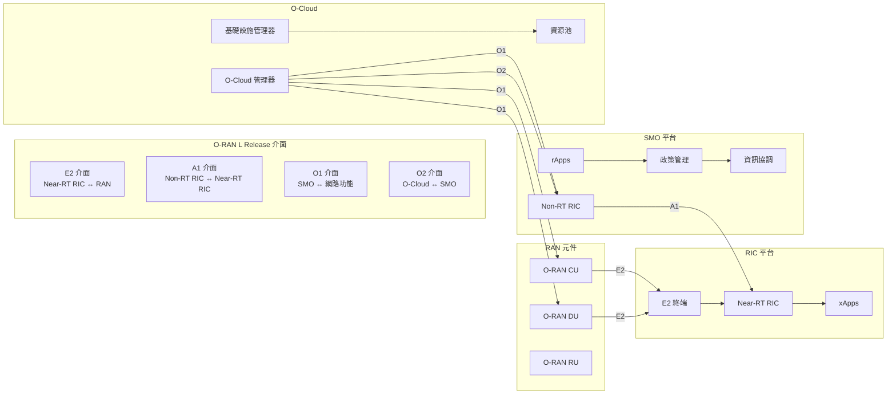
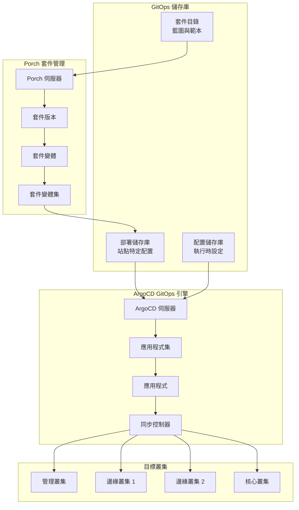
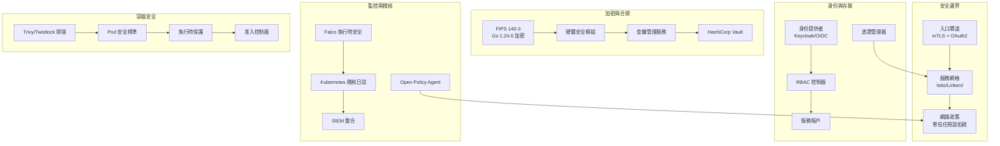
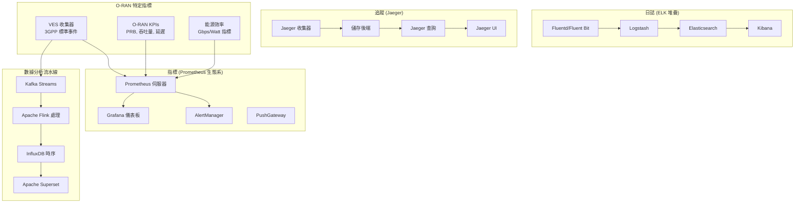
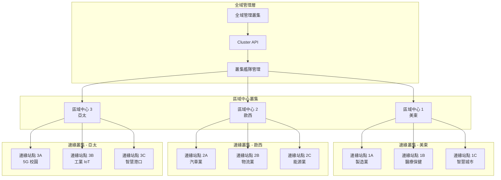
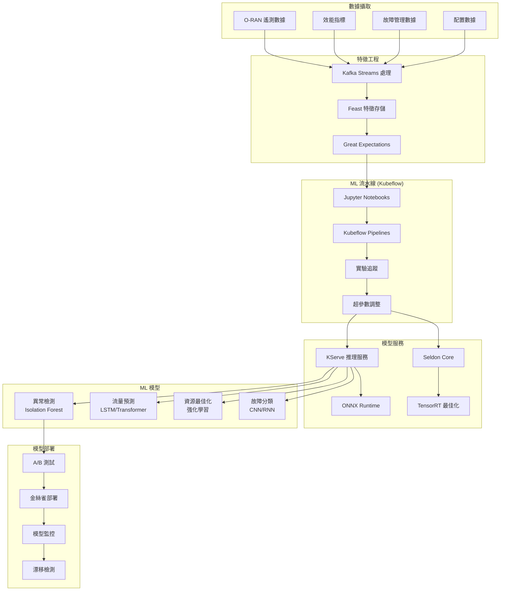

# 架構概述

Nephio O-RAN Claude Agents 專案實現了一個精密的雲原生架構，專為使用智能 AI 代理和 Nephio R5 基礎設施來編排複雜的 O-RAN L Release 部署而設計。

## 🏗️ 高階架構

## 🧠 代理架構

### 代理設計原則

1. **單一職責**：每個代理專精於特定領域
2. **自主運作**：代理可以獨立運行
3. **協作智能**：代理透過編排器進行協調
4. **事件驅動**：對系統狀態變化作出反應
5. **冪等性**：重試操作是安全的
6. **可觀測性**：完整的日誌記錄和指標

### 代理通信模式

## 📊 元件互動模型

### O-RAN 介面架構

## 🔄 部署工作流程架構

### GitOps 整合流程

## 🛡️ 安全架構

### 零信任安全模型

## 📈 可觀測性架構

### 可觀測性三支柱

## 🚀 效能與擴展性架構

### 多叢集擴展性模型

## 🧪 AI/ML 整合架構

### Kubeflow ML 流水線整合

## 🏷️ 主要架構原則

### 1. 雲原生優先
- **Kubernetes 原生**：所有元件都在 Kubernetes 上運行
- **容器化**：遵循 OCI 標準的所有容器化
- **12-Factor App**：遵循雲原生應用程式原則
- **API 驅動**：所有互動都透過 REST/GraphQL APIs

### 2. GitOps 一切
- **Git 為唯一真相來源**：所有配置都在 Git 中
- **聲明式**：基礎設施和應用程式即程式碼
- **自動化**：透過 GitOps 控制器進行持續部署
- **可稽核**：在 Git 中完整的變更歷史

### 3. 安全設計
- **零信任架構**：永不信任，總是驗證
- **最小權限**：最小必要權限
- **深度防禦**：多層安全防護
- **合規優先**：內建 WG11 和 FIPS 合規

### 4. 預設可觀測
- **無處不在的指標**：所有元件都有 Prometheus 指標
- **結構化日誌**：一致的 JSON 日誌格式
- **分散式追蹤**：端到端請求追蹤
- **客製化儀表板**：O-RAN 特定視覺化

### 5. AI 驅動運維
- **智能自動化**：AI 代理進行決策
- **預測性分析**：機器學習進行最佳化
- **自我修復**：自動問題檢測和解決
- **持續學習**：模型隨時間改進

---

## 下一步

- **[代理參考](/zh-TW/docs/agents/)**：了解個別代理功能
- **[整合模式](/zh-TW/docs/integration/)**：理解工作流程模式
- **[API 文件](/zh-TW/docs/api/)**：探索 API 規格
- **[範例](../examples/)**：查看真實世界實作範例