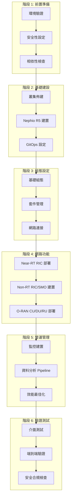
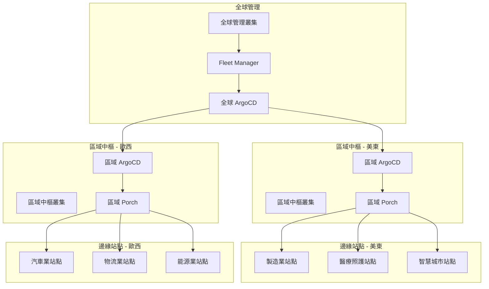
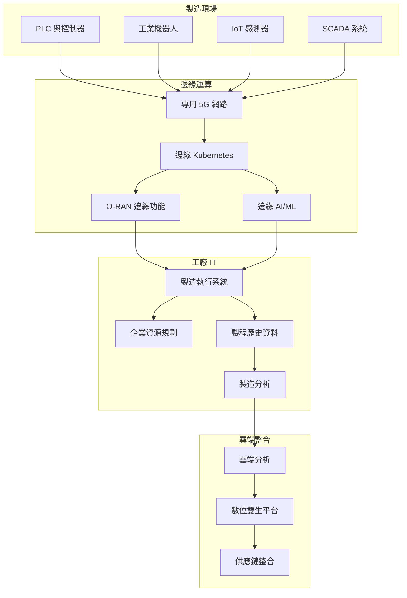

# 部署工作流程

本指南提供使用 Nephio O-RAN Claude 智能代理系統，針對不同使用情境與環境的完整部署工作流程。

## 🚀 標準部署工作流程

標準部署工作流程採用系統化方法，使用 Nephio R5 基礎設施部署完整的 O-RAN L Release 技術棧。

### 工作流程概覽



### 階段 1: 前置準備

#### 環境驗證
```bash
# 使用依賴診斷代理進行全面驗證
claude-agent dependency-doctor-agent "check dependencies"

# 驗證所有必要條件
claude-agent dependency-doctor-agent "verify environment"
```

**驗證項目：**
- Go 1.24.6 安裝與 FIPS 模式支援
- Kubernetes 叢集存取能力 (v1.30+)
- 必要的 CLI 工具 (kubectl, kpt, helm, argocd)
- 網路連線與 DNS 解析
- 儲存與運算資源可用性

#### 安全性設定
```bash
# 套用初始安全政策與 FIPS 模式
claude-agent security-compliance-agent "enforce_fips_mode"

# 建立 WG11 安全政策
claude-agent security-compliance-agent "apply_wg11_policies"

# 初始化零信任網路
claude-agent security-compliance-agent "apply_zero_trust_policies"
```

**設定項目：**
- FIPS 140-3 密碼學模式
- WG11 O-RAN 安全規範
- 零信任網路政策
- 初始 RBAC 與服務帳戶
- 憑證管理設定

### 階段 2: 基礎建設

#### 叢集佈建
```bash
# 建立管理叢集
claude-agent infrastructure-agent "create cluster"

# 安裝 Nephio R5 元件
claude-agent infrastructure-agent "install nephio"

# 設定 CNI 與儲存
claude-agent infrastructure-agent "setup networking"
claude-agent infrastructure-agent "setup storage"
```

**部署項目：**
- Kubernetes 叢集 (管理叢集 + 工作負載叢集)
- Nephio R5 核心元件 (Porch, controllers)
- ArgoCD GitOps 自動化
- CNI 元件 (Multus, SR-IOV, Whereabouts)
- 儲存方案 (OpenEBS, persistent volumes)

#### GitOps 設定
```bash
# 設定 ArgoCD 與儲存庫
claude-agent orchestrator-agent "setup multi-cluster"

# 建立套件儲存庫
claude-agent orchestrator-agent "create package variants"
```

**建立項目：**
- ArgoCD ApplicationSets 多叢集部署
- 套件與組態的 Git 儲存庫
- Porch 套件管理整合
- 跨叢集網路與安全性

### 階段 3: 組態設定

#### 基礎組態
```bash
# 透過 Porch 部署基礎組態
claude-agent config-management-agent "deploy package"

# 設定 YANG 模型
claude-agent config-management-agent "configure yang"

# 建立網路連接
claude-agent config-management-agent "setup network"
```

**設定項目：**
- Porch PackageRevisions 與 PackageVariants
- O-RAN YANG 模型驗證與部署
- O-RAN 介面的網路連接定義
- Kpt 函數 pipeline 客製化

### 階段 4: 網路功能

#### Near-RT RIC 平台
```bash
# 部署 Near-RT RIC 元件
claude-agent network-functions-agent "deploy ric"

# 設定 E2 介面
claude-agent network-functions-agent "configure e2"

# 部署 xApps
claude-agent network-functions-agent "deploy xapp"
```

**部署項目：**
- E2 Manager、E2 Termination、Subscription Manager
- A1 Mediator 政策執行
- 資料庫服務 (Redis, SDL)
- 特定使用情境的 xApps (KPIMon, Traffic Steering)

#### Non-RT RIC / SMO
```bash
# 部署 SMO 元件
claude-agent network-functions-agent "deploy smo"

# 設定 A1 政策
claude-agent network-functions-agent "configure a1"

# 部署 rApps
claude-agent network-functions-agent "deploy rapp"
```

**部署項目：**
- Policy Management Service
- Information Coordination Service (ICS)
- rApp Catalogue 與 rApp Manager
- Control Panel 與儀表板

#### O-RAN 網路功能
```bash
# 部署 O-RAN CU
claude-agent network-functions-agent "deploy cu"

# 部署 O-RAN DU
claude-agent network-functions-agent "deploy du"

# 部署 O-RU 模擬器 (測試用)
claude-agent network-functions-agent "deploy ru"
```

**部署項目：**
- O-RAN Central Unit (CU) 含 F1/E1 介面
- O-RAN Distributed Unit (DU) 含前傳介面
- O-RAN Radio Unit (RU) 測試模擬器
- 網路切片組態

### 階段 5: 營運管理

#### 監控建置
```bash
# 部署 Prometheus 技術棧
claude-agent monitoring-analytics-agent "setup monitoring"

# 設定 VES 收集器
claude-agent monitoring-analytics-agent "deploy ves"

# 匯入 Grafana 儀表板
claude-agent monitoring-analytics-agent "import dashboards"
```

**建立項目：**
- Prometheus O-RAN KPI 指標收集
- VES (Virtual Event Streaming) 3GPP 事件收集器
- Grafana O-RAN 視覺化儀表板
- AlertManager 主動式告警
- Jaeger 分散式追蹤

#### 資料分析 Pipeline
```bash
# 建立資料串流
claude-agent data-analytics-agent "setup kafka"

# 部署 KPI 計算器
claude-agent data-analytics-agent "deploy kpi calculator"

# 建置 ML pipeline
claude-agent data-analytics-agent "setup ml pipeline"
```

**部署項目：**
- Kafka KRaft 模式串流平台
- InfluxDB 時間序列資料儲存
- Apache Flink 串流處理
- Kubeflow ML/AI 模型管理
- 資料分析儀表板 (Superset)

#### 效能最佳化
```bash
# 分析效能
claude-agent performance-optimization-agent "full_performance_check"

# 最佳化能源效率
claude-agent performance-optimization-agent "optimize_ocloud_energy"

# 部署 AI 模型
claude-agent performance-optimization-agent "deploy_optimized_ai_models"
```

**最佳化項目：**
- 資源配置與 HPA 政策
- 能源效率目標 >0.5 Gbps/W
- AI/ML 推論最佳化 (&lt;50ms P99)
- 網路切片效能調校
- 跨叢集負載平衡

### 階段 6: 驗證測試

#### 介面測試
```bash
# 測試所有 O-RAN 介面
claude-agent testing-validation-agent "test_e2_interface"
claude-agent testing-validation-agent "test_a1_interface"
claude-agent testing-validation-agent "test_o1_interface"
claude-agent testing-validation-agent "test_o2_interface"
```

**驗證項目：**
- E2 介面與 RAN 功能 (KPM, RC, CCC)
- A1 介面政策執行
- O1 介面 YANG/NETCONF 操作
- O2 介面 O-Cloud 整合
- SMO 整合功能

#### 端到端驗證
```bash
# 執行完整測試套件
claude-agent testing-validation-agent "run_complete_test_suite"

# 產生測試報告
claude-agent testing-validation-agent "generate_test_report"
```

**測試項目：**
- 網路切片端到端功能
- 多叢集通訊
- 效能基準測試 (延遲、吞吐量)
- 容錯與復原能力
- 負載測試與可擴展性

#### 安全合規檢查
```bash
# 最終安全稽核
claude-agent security-compliance-agent "full_security_audit"

# 容器漏洞掃描
claude-agent security-compliance-agent "scan_all_containers"
```

**驗證項目：**
- WG11 O-RAN 安全規範合規
- FIPS 140-3 密碼學合規
- 零信任網路政策執行
- 容器安全與漏洞管理
- 稽核日誌與合規報告

## 🌍 多站點邊緣部署

適用於跨多個地理位置的分散式邊緣運算情境。

### 部署模式



### 工作流程步驟

1. **全球管理設定**
   ```bash
   # 部署全球管理叢集
   claude-agent orchestrator-agent "deploy global management"
   
   # 建立艦隊管理
   claude-agent infrastructure-agent "setup fleet management"
   ```

2. **區域中樞部署**
   ```bash
   # 部署區域中樞
   claude-agent orchestrator-agent "deploy regional hubs"
   
   # 設定跨區域網路
   claude-agent infrastructure-agent "setup cross-region networking"
   ```

3. **邊緣站點佈建**
   ```bash
   # 為邊緣站點建立 PackageVariantSet
   claude-agent orchestrator-agent "create edge package variants"
   
   # 部署邊緣專屬組態
   claude-agent config-management-agent "deploy edge configurations"
   ```

4. **邊緣網路功能**
   ```bash
   # 部署輕量化 O-RAN 元件
   claude-agent network-functions-agent "deploy edge oran components"
   
   # 為各站點設定網路切片
   claude-agent orchestrator-agent "deploy network slice urllc"
   ```

5. **邊緣監控與分析**
   ```bash
   # 建立分散式監控
   claude-agent monitoring-analytics-agent "setup edge monitoring"
   
   # 部署邊緣 AI/ML
   claude-agent data-analytics-agent "setup edge ml"
   ```

## 🏭 工業 IoT 製造業

專為超低延遲製造環境設計的特殊工作流程。

### 需求規格
- **延遲**: 關鍵控制迴路 &lt;1ms
- **可靠性**: 99.999% 運行時間
- **安全性**: OT/IT 融合與嚴格隔離
- **整合**: 既有 MES/ERP 系統整合

### 工作流程



### 部署步驟

1. **工業基礎設施建置**
   ```bash
   # 部署強固型邊緣叢集
   claude-agent infrastructure-agent "create industrial cluster"
   
   # 設定 OT/IT 網路分段
   claude-agent security-compliance-agent "setup industrial security"
   ```

2. **URLLC 網路切片**
   ```bash
   # 部署超低延遲切片
   claude-agent orchestrator-agent "deploy network slice urllc"
   
   # 設定確定性網路
   claude-agent config-management-agent "configure deterministic network"
   ```

3. **製造業整合**
   ```bash
   # 部署製造業專屬 O-RAN 功能
   claude-agent network-functions-agent "deploy manufacturing oran"
   
   # 建立 OPC-UA 整合
   claude-agent config-management-agent "setup opcua integration"
   ```

4. **預測性維護 AI**
   ```bash
   # 部署邊緣 AI 預測性維護
   claude-agent data-analytics-agent "deploy predictive maintenance"
   
   # 建立即時異常偵測
   claude-agent performance-optimization-agent "setup anomaly detection"
   ```

5. **工業測試**
   ```bash
   # 執行工業專屬測試
   claude-agent testing-validation-agent "test industrial requirements"
   
   # 驗證安全系統
   claude-agent testing-validation-agent "test safety validation"
   ```

## 🔬 研究與開發

針對 O-RAN 研究環境的加速部署，具備快速原型開發能力。

### 研究環境特性
- **快速部署**: 完整技術棧 &lt;15 分鐘
- **靈活性**: 元件易於替換與測試
- **可觀測性**: 全面的資料收集
- **實驗性**: A/B 測試與混沌工程

### 工作流程

1. **快速技術棧部署**
   ```bash
   # 一鍵研究部署
   claude-agent orchestrator-agent "deploy research stack"
   
   # 啟用開發模式
   export ORAN_RESEARCH_MODE=true
   ```

2. **實驗性組態**
   ```bash
   # 部署實驗性 xApps
   claude-agent network-functions-agent "deploy experimental xapp"
   
   # 建立 A/B 測試框架
   claude-agent testing-validation-agent "setup ab testing"
   ```

3. **資料收集**
   ```bash
   # 強化資料收集
   claude-agent data-analytics-agent "setup research analytics"
   
   # 匯出研究資料
   claude-agent data-analytics-agent "export research data"
   ```

4. **混沌工程**
   ```bash
   # 執行混沌實驗
   claude-agent testing-validation-agent "run chaos tests"
   
   # 分析韌性模式
   claude-agent performance-optimization-agent "analyze resilience"
   ```

## 🚧 故障排除工作流程

### 常見部署問題

#### 問題：套件部署失敗
```bash
# 診斷套件問題
claude-agent dependency-doctor-agent "diagnose package failure"

# 檢查 Porch 狀態
kubectl get packagerevisions -A
kubectl logs -n porch-system -l app=porch-server

# 修復並重試
claude-agent config-management-agent "fix package deployment"
```

#### 問題：E2 連線問題
```bash
# 測試 E2 連線
claude-agent testing-validation-agent "test_e2_interface"

# 檢查 E2Term 日誌
kubectl logs -n oran -l app=e2term

# 必要時重新啟動 E2 元件
kubectl rollout restart deployment/e2term -n oran
```

#### 問題：效能低於目標
```bash
# 分析效能
claude-agent performance-optimization-agent "full_performance_check"

# 識別瓶頸
claude-agent monitoring-analytics-agent "analyze performance bottlenecks"

# 套用最佳化
claude-agent performance-optimization-agent "quick_optimize oran"
```

### 復原程序

#### 完整部署復原
```bash
# 保存當前狀態
claude-agent orchestrator-agent "backup current state"

# 識別故障點
claude-agent dependency-doctor-agent "analyze failure"

# 回滾至已知良好狀態
claude-agent orchestrator-agent "rollback to last known good"

# 重新執行失敗階段
claude-agent orchestrator-agent "resume deployment from infrastructure"
```

---

## 最佳實務

### 1. 部署前驗證
- 務必先執行相依性檢查
- 驗證網路連線與 DNS
- 確保有足夠的資源可用
- 檢查安全合規需求

### 2. 階段性部署
- 遵循標準工作流程階段
- 各階段完成前先驗證
- 在階段邊界維護回滾點
- 部署期間監控系統健康狀況

### 3. 監控整合
- 在部署早期建立監控
- 為關鍵元件設定告警
- 建立基準效能指標
- 為所有服務實施健康檢查

### 4. 安全至上
- 從一開始就套用安全政策
- 使用 FIPS 合規的密碼學
- 實施零信任網路
- 定期進行安全掃描與稽核

### 5. 文件與日誌
- 記錄所有組態變更
- 維護部署日誌與產出物
- 為操作程序建立運作手冊
- 保持安全與合規文件的最新狀態

這些工作流程為使用 Nephio O-RAN Claude 智能代理系統跨各種使用情境與環境部署 O-RAN 網路提供了堅實的基礎。