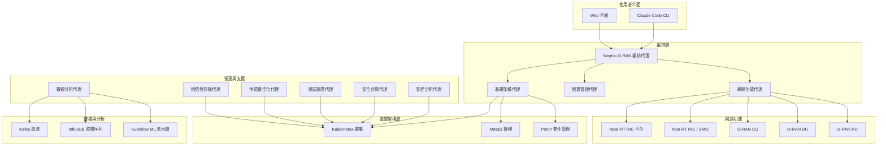

# Nephio O-RAN Claude 代理

歡迎來到 **Nephio O-RAN Claude 代理** 專案 - 一個進階的雲原生編排系統，透過使用尖端 AI 代理將自然語言網路營運與 O-RAN 合規部署相結合。

## 🎯 專案使命

Nephio O-RAN Claude 代理專案為使用 Nephio R5 基礎架構部署、管理和最佳化 O-RAN L 發行版網路提供智慧自動化。我們的 AI 驅動代理能理解自然語言指令，並精確可靠地執行複雜的網路操作。

## 🏗️ 系統架構

我們的系統由 10 個專門代理組成，共同提供全面的 O-RAN 網路生命週期管理：



## 🚀 主要功能

### 🤖 智慧代理系統
- **10 個專門代理**：每個代理都是特定領域的專家
- **自然語言處理**：理解並執行純英文指令
- **自主營運**：代理可以獨立或協作運作
- **自我修復**：自動檢測和解決問題

### 🌐 O-RAN L 發行版合規性
- **完整介面支援**：E2、A1、O1、O2 介面完全實現
- **WG11 安全標準**：進階安全和合規性驗證
- **SMO 整合**：完整的服務管理與編排支援
- **RAN 功能**：KPM、RC 和 CCC RAN 功能支援

### ☸️ Nephio R5 整合
- **Porch 套件管理**：進階 GitOps 基礎套件編排
- **PackageVariantSet**：多叢集部署自動化
- **O-Cloud 整合**：雲原生基礎架構管理
- **FIPS 140-3 合規性**：使用 Go 1.24.6 的安全加密操作

### 🔧 進階自動化
- **基礎架構即代碼**：聲明式基礎架構管理
- **GitOps 工作流程**：基於 ArgoCD 和 Flux 的持續部署
- **零停機時間營運**：藍綠和金絲雀部署
- **多叢集管理**：跨邊緣和核心的無縫操作

## 📋 代理清單

| 代理 | 目的 | 模型 | 能力 |
|-------|---------|-------|--------------|
| **編排代理** | 主協調器 | Claude Opus | 多叢集部署、工作流程管理、套件變體編排 |
| **基礎架構代理** | 基礎架構供應 | Claude Sonnet | Kind/Metal3 叢集、Nephio R5 元件、ArgoCD、儲存 |
| **配置管理代理** | 配置部署 | Claude Haiku | Porch 套件、YANG 模型、網路連接、kpt 功能 |
| **網路功能代理** | O-RAN 網路功能 | Claude Haiku | Near-RT RIC、SMO、xApps、rApps、CU/DU/RU 部署 |
| **監控分析代理** | 可觀察性堆疊 | Claude Sonnet | Prometheus、Grafana、VES 收集器、Jaeger 追蹤 |
| **數據分析代理** | 數據處理 | Claude Sonnet | Kafka 串流、InfluxDB、Flink 處理、ML 流水線 |
| **安全合規代理** | 安全驗證 | Claude Sonnet | WG11 合規性、FIPS 模式、容器掃描、零信任 |
| **性能最佳化代理** | 性能調整 | Claude Opus | SMO 最佳化、能源效率、AI/ML 加速 |
| **測試驗證代理** | 端到端測試 | Claude Haiku | 介面測試、混沌工程、負載測試、Go 覆蓋率 |
| **相依性診斷代理** | 相依性解決 | Claude Sonnet | Go 模組、Python 套件、系統程式庫、容器修復 |

## 🎯 使用案例

### 🏢 企業 5G 部署
為企業使用案例部署完整的專用 5G 網路與 O-RAN 元件：
- 自動化基礎架構供應
- 符合 WG11 標準的安全優先部署
- 針對特定工作負載的性能最佳化
- 持續監控和分析

### 🌍 多站點邊緣運算
跨多個站點管理分散式邊緣運算基礎架構：
- PackageVariantSet 用於站點特定配置
- 具有永續性指標的節能操作
- AI/ML 工作負載放置和最佳化
- 零接觸供應和維護

### 🔬 研究與開發
使用快速原型能力加速 O-RAN 研究：
- 快速部署測試環境
- 韌性測試的混沌工程
- 自定義 xApp 和 rApp 開發工作流程
- 全面的性能基準測試

### 🏭 工業物聯網與製造
為製造業和物聯網部署工業級 5G 網路：
- 超低延遲網路切片管理
- 使用 AI/ML 分析的預測性維護
- 嚴格的安全和合規要求
- 與現有工業系統的整合

## 🚀 快速開始

### 先決條件
- Kubernetes 1.30+
- Go 1.24.6（支援 FIPS 140-3）
- Docker/Podman
- Helm 3.x
- kubectl 和 kpt CLI 工具

### 1分鐘演示
```bash
# 克隆儲存庫
git clone https://github.com/your-org/nephio-oran-claude-agents.git
cd nephio-oran-claude-agents

# 從基礎架構設置開始
claude-agent infrastructure-agent "create cluster"

# 部署 O-RAN 元件
claude-agent network-functions-agent "deploy ric"

# 監控部署
claude-agent monitoring-agent "setup monitoring"

# 驗證一切正常運作
claude-agent testing-validation-agent "quick validation"
```

### 標準部署工作流程
1. **基礎架構設置**：使用 Nephio R5 建立 Kubernetes 叢集
2. **安全配置**：應用 WG11 安全策略和 FIPS 模式
3. **網路功能部署**：透過 Porch 套件部署 O-RAN 元件
4. **監控與分析**：設置可觀察性和數據處理
5. **性能最佳化**：應用能源效率和 AI/ML 最佳化
6. **驗證與測試**：執行全面的端到端測試套件

## 📊 系統需求

### 最低需求
- **CPU**：16 核心
- **記憶體**：64GB RAM
- **儲存**：500GB SSD
- **網路**：10Gbps 連接

### 生產環境建議
- **CPU**：32+ 核心支援 SR-IOV
- **記憶體**：128GB+ RAM
- **儲存**：2TB+ NVMe SSD
- **網路**：25Gbps+ 支援 DPDK
- **GPU**：NVIDIA A100 或等效的 AI/ML 工作負載

## 🔧 技術堆疊

### 核心技術
- **容器平台**：Kubernetes 1.30+、containerd
- **套件管理**：Helm、kpt、Porch
- **GitOps**：ArgoCD、Flux
- **服務網格**：Istio（可選）
- **儲存**：OpenEBS、Rook-Ceph

### O-RAN 元件
- **Near-RT RIC**：O-RAN SC 平台 v3.0.0+
- **Non-RT RIC/SMO**：O-RAN SC Non-RT RIC v2.5.0+
- **E2 介面**：基於 ASN.1 的 RAN 功能
- **A1 介面**：RESTful 策略管理
- **O1 介面**：NETCONF/YANG 配置

### 數據與分析
- **串流**：Apache Kafka with KRaft
- **時間序列**：InfluxDB 2.x
- **處理**：Apache Flink
- **ML/AI**：Kubeflow、KServe、ONNX Runtime
- **視覺化**：Grafana、Superset

### 安全與合規性
- **加密**：FIPS 140-3 with Go 1.24.6
- **網路安全**：Calico、網路策略
- **容器安全**：Falco、Trivy 掃描
- **機密管理**：External Secrets Operator

## 📚 文件結構

此文件組織為以下章節：

- **快速開始**：快速設置和基本操作
- **架構**：系統設計和元件互動
- **代理**：個別代理文件和能力
- **整合**：工作流程指南和最佳實踐
- **API 參考**：完整的 API 文件
- **範例**：真實世界使用情境
- **故障排除**：常見問題和解決方案

## 🤝 社群與支援

### 獲得協助
- **文件**：全面的指南和 API 參考
- **GitHub Issues**：錯誤報告和功能請求
- **社群 Slack**：即時討論和支援
- **辦公時間**：每週社群通話

### 貢獻
我們歡迎社群的貢獻！無論是：
- 錯誤報告和修復
- 新代理能力
- 文件改進
- 性能最佳化
- 安全增強

請參閱我們的貢獻指南了解如何開始的詳細資訊。

### 路線圖
我們的開發路線圖包括：
- **2024 Q4**：O-RAN L 發行版完全合規性
- **2025 Q1**：進階 AI/ML 整合
- **2025 Q2**：多雲部署支援
- **2025 Q3**：邊緣運算最佳化
- **2025 Q4**：6G 研究整合

## ⚡ 性能基準

| 指標 | 目標 | 典型 |
|--------|--------|---------|
| E2 設置時間 | < 5 秒 | 2.3秒 |
| A1 策略部署 | < 2 秒 | 0.8秒 |
| 套件部署 | < 30 秒 | 18秒 |
| AI/ML 推理 (P99) | < 50ms | 42ms |
| 能源效率 | > 0.5 Gbps/W | 0.73 Gbps/W |
| 測試覆蓋率 | > 85% | 87.3% |

## 🔐 安全與合規性

- **FIPS 140-3**：加密模組驗證
- **WG11 標準**：O-RAN 安全規格
- **零信任**：網路安全架構
- **RBAC**：基於角色的存取控制
- **稽核記錄**：全面的安全事件記錄
- **漏洞掃描**：持續的容器和相依性掃描

## 📈 監控與可觀察性

- **即時指標**：Prometheus 與自定義 O-RAN 指標
- **分散式追蹤**：Jaeger 端到端請求追蹤
- **日誌聚合**：Fluentd 與 ELK 堆疊
- **警報**：AlertManager 與 PagerDuty 整合
- **儀表板**：O-RAN KPI 的預建 Grafana 儀表板

---

## 下一步

準備開始了嗎？以下是一些建議的下一步：

1. **快速開始指南** - 幾分鐘內上手並執行
2. **架構概述** - 了解系統設計
3. **代理文件** - 學習個別代理能力
4. **API 參考** - 與我們的 API 整合
5. **範例** - 查看真實世界使用情境

歡迎來到自動化 O-RAN 網路營運的未來！🚀