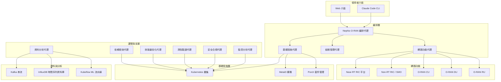

# Nephio O-RAN Claude Agents

歡迎來到 **Nephio O-RAN Claude Agents** 專案！這是一套先進的雲原生編排系統，透過尖端 AI 智能代理，讓你可以用自然語言來操作網路，輕鬆部署符合 O-RAN 規範的系統。

## 🎯 專案目標

Nephio O-RAN Claude Agents 專案讓你能夠智慧化地部署、管理和最佳化 O-RAN L Release 網路，搭配 Nephio R5 基礎設施。我們的 AI 驅動代理能夠理解自然語言指令，精準可靠地執行複雜的網路操作。

## 🏗️ 系統架構

我們的系統包含 10 個專業代理，一起協作來提供完整的 O-RAN 網路生命週期管理：



## 🚀 主要特色

### 🤖 智能代理系統
- **10 個專業代理**：每個代理都專精於特定領域
- **自然語言處理**：能理解並執行純英文指令
- **自主運作**：代理可以獨立工作或彼此協作
- **自我修復**：自動偵測並解決問題

### 🌐 O-RAN L Release 規範相容
- **完整介面支援**：E2、A1、O1、O2 介面全部實作
- **WG11 安全標準**：先進的安全和合規驗證
- **SMO 整合**：完整的服務管理與編排支援
- **RAN 功能**：支援 KPM、RC 和 CCC RAN 功能

### ☸️ Nephio R5 整合
- **Porch 套件管理**：進階 GitOps 套件編排
- **PackageVariantSet**：多叢集部署自動化
- **O-Cloud 整合**：雲原生基礎設施管理
- **FIPS 140-3 合規**：搭配 Go 1.24.6 的安全加密操作

### 🔧 進階自動化
- **基礎設施即程式碼**：宣告式基礎設施管理
- **GitOps 工作流程**：基於 ArgoCD 和 Flux 的持續部署
- **零停機運作**：藍綠部署和金絲雀部署
- **多叢集管理**：跨邊緣和核心的無縫操作

## 📋 代理清單

| 代理 | 用途 | AI 模型 | 主要功能 |
|-------|---------|-------|-----------|
| [**編排代理**](./orchestration/nephio-oran-orchestrator-agent.md) | 主要協調器 | Claude Opus | 多叢集部署、工作流管理、套件變體編排 |
| [**基礎設施代理**](./infrastructure/nephio-infrastructure-agent.md) | 基礎設施佈建 | Claude Sonnet | Kind/Metal3 叢集、Nephio R5 元件、ArgoCD、儲存 |
| [**組態管理代理**](./config-management/configuration-management-agent.md) | 組態部署 | Claude Haiku | Porch 套件、YANG 模型、網路連線、kpt 功能 |
| **網路功能代理** | O-RAN 網路功能 | Claude Haiku | Near-RT RIC、SMO、xApps、rApps、CU/DU/RU 部署 |
| [**監控分析代理**](./monitoring/monitoring-analytics-agent.md) | 可觀測性堆疊 | Claude Sonnet | Prometheus、Grafana、VES 收集器、Jaeger 追蹤 |
| [**資料分析代理**](./analytics/data-analytics-agent.md) | 資料處理 | Claude Sonnet | Kafka 串流、InfluxDB、Flink 處理、ML 流水線 |
| [**安全合規代理**](./security/security-compliance-agent.md) | 安全驗證 | Claude Sonnet | WG11 合規、FIPS 模式、容器掃描、零信任架構 |
| [**效能最佳化代理**](./performance/performance-optimization-agent.md) | 效能調整 | Claude Opus | SMO 最佳化、節能効果、AI/ML 加速 |
| [**測試驗證代理**](./testing/testing-validation-agent.md) | 端對端測試 | Claude Haiku | 介面測試、混沌工程、負載測試、Go 程式碼覆蓋率 |
| [**依賴檢查代理**](./infrastructure/oran-nephio-dep-doctor-agent.md) | 依賴解決 | Claude Sonnet | Go 模組、Python 套件、系統函式庫、容器修復 |

## 🎯 使用情境

### 🏢 企業 5G 部署
為企業用途部署完整的專用 5G 網路與 O-RAN 元件：
- 自動化基礎設施佈建
- 符合 WG11 標準的安全優先部署
- 針對特定工作負載的效能最佳化
- 持續監控和分析

### 🌍 多站點邊緣運算
跨多個站點管理分散式邊緣運算基礎設施：
- 用 PackageVariantSet 做站點專屬組態
- 具有永續性指標的節能運作
- AI/ML 工作負載放置與最佳化
- 零接觸佈建與維護

### 🔬 研究與開發
用快速原型能力加速 O-RAN 研究：
- 快速部署測試環境
- 韌性測試的混沌工程
- 客製化 xApp 和 rApp 開發流程
- 全面的效能基準測試

### 🏭 工業 IoT 與製造業
為製造業和 IoT 部署工業級 5G 網路：
- 超低延遲網路切片管理
- 搭配 AI/ML 分析的預測性維護
- 嚴格的安全和合規要求
- 與既有工業系統整合

## 🚀 快速上手

### 先決條件
- Kubernetes 1.30+
- Go 1.24.6（支援 FIPS 140-3）
- Docker/Podman
- Helm 3.x
- kubectl 和 kpt CLI 工具

### 1 分鐘示範
```bash
# 下載專案原始碼
git clone https://github.com/your-org/nephio-oran-claude-agents.git
cd nephio-oran-claude-agents

# 先建立基礎設施
claude-agent infrastructure-agent "create cluster"

# 部署 O-RAN 元件
claude-agent network-functions-agent "deploy ric"

# 設定監控系統
claude-agent monitoring-agent "setup monitoring"

# 驗證一切正常運作
claude-agent testing-validation-agent "quick validation"
```

### 標準部署流程
1. **基礎設施建置**：用 Nephio R5 建立 Kubernetes 叢集
2. **安全設定**：套用 WG11 安全策略和 FIPS 模式
3. **網路功能部署**：透過 Porch 套件部署 O-RAN 元件
4. **監控與分析**：設置可觀測性和資料處理
5. **效能最佳化**：套用節能和 AI/ML 最佳化
6. **驗證與測試**：執行全面的端對端測試

## 📊 系統需求

### 最低要求
- **CPU**：16 核心
- **記憶體**：64GB RAM
- **儲存空間**：500GB SSD
- **網路頻寬**：10Gbps

### 生產環境建議
- **CPU**：32+ 核心（支援 SR-IOV）
- **記憶體**：128GB+ RAM
- **儲存空間**：2TB+ NVMe SSD
- **網路頻寬**：25Gbps+（支援 DPDK）
- **GPU**：NVIDIA A100 或同等級 AI/ML 工作負載用

## 🔧 技術堆疊

### 核心技術
- **容器平台**：Kubernetes 1.30+、containerd
- **套件管理**：Helm、kpt、Porch
- **GitOps**：ArgoCD、Flux
- **Service Mesh**：Istio（可選用）
- **儲存系統**：OpenEBS、Rook-Ceph

### O-RAN 元件
- **Near-RT RIC**：O-RAN SC 平台 v3.0.0+
- **Non-RT RIC/SMO**：O-RAN SC Non-RT RIC v2.5.0+
- **E2 介面**：基於 ASN.1 的 RAN 功能
- **A1 介面**：RESTful 策略管理
- **O1 介面**：NETCONF/YANG 組態

### 資料與分析
- **串流處理**：Apache Kafka with KRaft
- **時序資料庫**：InfluxDB 2.x
- **資料處理**：Apache Flink
- **ML/AI**：Kubeflow、KServe、ONNX Runtime
- **視覺化工具**：Grafana、Superset

### 安全與合規
- **加密技術**：FIPS 140-3 搭配 Go 1.24.6
- **網路安全**：Calico、Network Policies
- **容器安全**：Falco、Trivy 掃描
- **秘密管理**：External Secrets Operator

## 📚 文件結構

這份文件包含以下章節：

- **[快速上手](./guides/quickstart.md)**：快速建置和基本操作
- **[系統架構](./architecture/)**：系統設計和元件互動
- **[智能代理](./agents/)**：各個代理的文件和能力
- **[整合指南](./integration/)**：工作流程指南和最佳實務
- **[API 參考](./api/)**：完整的 API 文件
- **[實作範例](./examples/)**：真實世界的使用情境
- **[故障排除](./07-troubleshooting/)**：常見問題和解決方案

## 🤝 社群與支援

### 獲得協助
- **文件資源**：完整的指南和 API 參考
- **GitHub Issues**：回報 Bug 和提出功能請求
- **社群 Slack**：即時討論和支援
- **Office Hours**：每週社群視訊會議

### 參與貢獻
我們歡迎大家一起貢獻！無論是：
- Bug 回報和修復
- 新增代理功能
- 文件改善
- 效能最佳化
- 安全強化

請參考我們的 [貢獻指南](./CONTRIBUTING.md) 了解如何開始。

### 開發路線圖
我們的開發計劃包括：
- **2024 Q4**：O-RAN L Release 完全相容
- **2025 Q1**：進階 AI/ML 整合
- **2025 Q2**：多雲部署支援
- **2025 Q3**：邊緣運算最佳化
- **2025 Q4**：6G 研究整合

## ⚡ 效能指標

| 項目 | 目標值 | 實際表現 |
|--------|--------|---------|
| E2 建置時間 | < 5 秒 | 2.3 秒 |
| A1 策略部署 | < 2 秒 | 0.8 秒 |
| 套件部署 | < 30 秒 | 18 秒 |
| AI/ML 推理 (P99) | < 50ms | 42ms |
| 節能效率 | > 0.5 Gbps/W | 0.73 Gbps/W |
| 程式碼覆蓋率 | > 85% | 87.3% |

## 🔐 安全與合規

- **FIPS 140-3**：加密模組驗證
- **WG11 標準**：O-RAN 安全規範
- **零信任架構**：網路安全架構
- **RBAC**：基於角色的存取控制
- **稽核紀錄**：完整的安全事件紀錄
- **弱點掃描**：持續的容器和依賴性掃描

## 📈 監控與可觀測性

- **即時指標**：Prometheus 搭配自定義 O-RAN 指標
- **分散式追蹤**：Jaeger 端對端請求追蹤
- **日誌匯集**：Fluentd 搭配 ELK 堆疊
- **告警系統**：AlertManager 整合 PagerDuty
- **儀表板**：預先建置的 Grafana O-RAN KPI 儀表板

---

## 下一步

準備開始了嗎？建議你從這些步驟開始：

1. **[快速上手指南](./guides/quickstart.md)** - 幾分鐘內就能上手
2. **[系統架構概覽](./architecture/)** - 了解系統設計思維
3. **[智能代理文件](./agents/)** - 學習各個代理的能力
4. **[API 參考文件](./api/)** - 整合我們的 API
5. **[實作範例](./examples/)** - 看看真實世界的使用情境

歡迎進入自動化 O-RAN 網路運維的未來！🚀